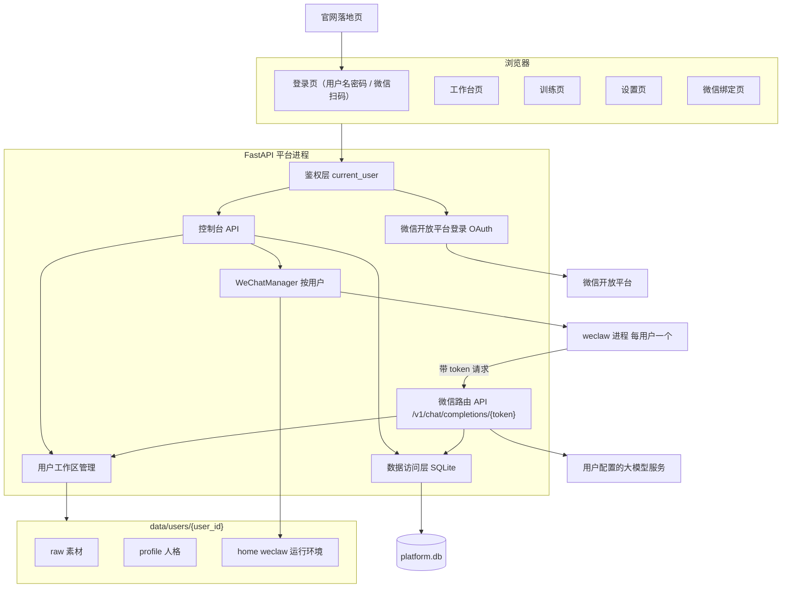
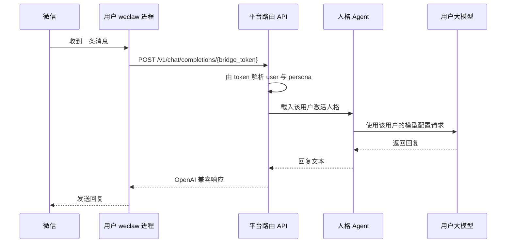
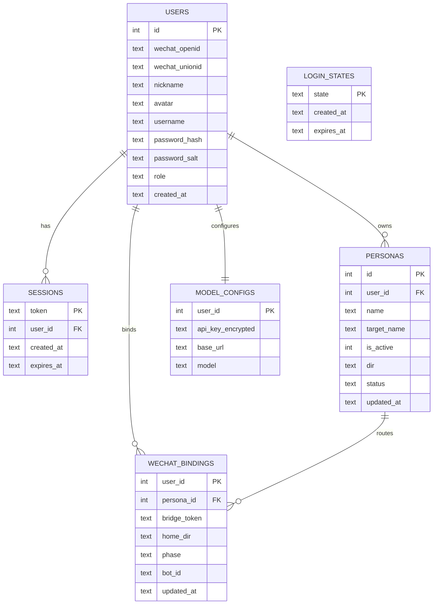

# 多用户人格平台

Feature Name: multi-user-personas
Updated: 2026-09-13

## Description

在现有 `ex_persona` 单实例实现之上引入多租户能力，产品形态对标 wxecho.cn：对外有官网落地页，用户登录后进入多页面工作台创作人格，并把人格接入自己的微信。平台在同一个进程中承载多个账号，为每个账号维护独立的工作区、人格档案、模型配置与微信桥接。微信消息经桥接令牌路由到对应用户当前激活的人格。

本轮以用户名密码登录为默认路径，微信开放平台扫码登录以特性开关预留：配置 `WECHAT_APP_ID` 与 `WECHAT_APP_SECRET` 后自动启用扫码入口，未配置时登录页仅展示用户名密码。

设计目标：

- 数据隔离：用户之间的素材、人格、配置与微信状态以用户为界严格隔离。
- 复用现有管线：`ingest`、`sources`、`distill`、`agent`、`retrieval`、`llm` 保持函数级复用，仅把「路径与配置来源」从全局改为按用户解析。
- 每用户独立微信：为每个用户分配独立的 HOME 与 weclaw 配置目录，并管理其 `weclaw login/start/stop` 生命周期。
- 多页面控制台：登录、工作台、训练、设置、微信绑定拆分为独立页面。

## Architecture



消息路由时序：



## Components and Interfaces

### 组件

| 组件 | 文件 | 职责 |
|------|------|------|
| 账号服务 | `ex_persona/accounts.py` | 微信身份与账号绑定、会话签发与校验、可选用户名密码 |
| 微信登录 | `ex_persona/wechat_login.py` | 预留：微信开放平台网页登录的授权 URL 生成、state 校验与 code 换取身份，未配置凭据时禁用 |
| 平台数据层 | `ex_persona/store.py` | SQLite 连接、建表、用户/会话/人格/模型配置/桥接的 CRUD |
| 用户工作区 | `ex_persona/workspace.py` | 解析并创建 `data/users/{user_id}` 下的 raw/profile/home 路径，路径安全校验 |
| 密钥托管 | `ex_persona/crypto.py` | 基于平台主密钥的 Fernet 加解密与脱敏 |
| 微信桥接管理 | `ex_persona/wechat.py` 扩展 | 按 user_id 管理 weclaw 登录与受管进程，隔离 HOME 与配置 |
| 控制台 API | `ex_persona/webapp.py` 扩展 | 登录态接口、工作台数据、上传、蒸馏、设置、微信绑定、导出、注销 |
| 路由 API | `ex_persona/server.py` 扩展 | `/v1/chat/completions/{bridge_token}` 按用户与人格路由 |
| 前端页面 | `web/` | 官网落地页、微信扫码登录页、工作台、训练、设置、微信绑定 |

### 接口

鉴权：默认用户名密码登录，密码以 `hashlib.scrypt` 加盐哈希保存。会话 Cookie 名为 `persona_session`，值指向 `sessions` 表中的随机令牌。微信开放平台扫码登录以特性开关预留：配置 `WECHAT_APP_ID`、`WECHAT_APP_SECRET` 与 `WECHAT_REDIRECT_URI` 后启用，登录前生成随机 state 并在回调时校验。

控制台 API：

| 方法 | 路径 | 说明 |
|------|------|------|
| GET | `/` | 官网落地页 |
| GET | `/login` | 登录页（含可选微信扫码入口） |
| POST | `/api/auth/register` | 用户名密码注册并初始化工作区 |
| POST | `/api/auth/login` | 用户名密码登录并下发会话 |
| POST | `/api/auth/logout` | 失效当前会话 |
| GET | `/api/auth/wechat/url` | 预留：返回微信授权地址并写入一次性 state |
| GET | `/api/auth/wechat/callback` | 预留：微信回调，校验 state、以 code 换身份、建号并下发会话 |
| GET | `/api/me` | 返回当前用户、激活人格、桥接摘要 |
| GET/POST | `/api/personas` | 列出 / 新建人格 |
| POST | `/api/personas/{id}/activate` | 切换激活人格 |
| POST | `/api/upload` | 上传素材到当前用户工作区 |
| POST | `/api/paste` | 保存粘贴文本素材 |
| POST | `/api/ingest` | 解析素材并写入指定人格 |
| POST | `/api/distill` | 蒸馏指定人格 |
| GET/PUT | `/api/model-config` | 读取（脱敏）/ 更新模型配置 |
| GET | `/api/wechat/qrcode` | 获取当前用户绑定二维码 |
| GET | `/api/wechat/status` | 当前用户桥接状态 |
| POST | `/api/wechat/start` / `/api/wechat/stop` | 启停当前用户桥接 |
| GET | `/api/export` | 导出当前用户人格档案 |
| POST | `/api/account/delete` | 校验密码后注销账号 |
| GET | `/api/admin/users` | 管理员列出用户 |

路由 API：

| 方法 | 路径 | 说明 |
|------|------|------|
| POST | `/v1/chat/completions/{bridge_token}` | 依据令牌路由到用户人格并返回 OpenAI 兼容响应 |

每个用户的 weclaw 配置指向 `http://127.0.0.1:8000/v1/chat/completions/{bridge_token}`。

## Data Models

SQLite 库文件 `data/platform.db`。



密码：`hashlib.scrypt`（N=2^14, r=8, p=1）配合每用户 16 字节随机盐，比较使用 `hmac.compare_digest`。

用户目录：

```
data/users/{user_id}/
  raw/                     上传与粘贴素材
  profile/{persona_id}/    人格档案 SKILL.md / persona_card.json / style.json / pairs.jsonl
  home/.weclaw/            weclaw 配置与账号状态
```

桥接令牌：32 字节随机十六进制，仅用于路由，不出现在前端响应中。

## Correctness Properties

1. 对任意请求，若其访问的资源 `user_id` 不等于会话 `user_id`，请求以未授权结束，且任何用户文件写入路径都位于 `data/users/{会话 user_id}` 之下。
2. 明文密码与明文 API Key 在数据库、日志与 HTTP 响应中均不出现。
3. 任一时刻，任一用户最多存在一个受管的 weclaw 前台进程。
4. 微信消息经 `bridge_token` 解析后，只会进入令牌所属用户当前激活的人格。
5. 会话令牌在过期或登出后不再通过校验。
6. 蒸馏失败时该用户已有人格档案保持不变（先写临时目录再原子替换）。
7. 平台进程退出时，全部受管桥接进程被终止。

## Error Handling

| 场景 | 处理 |
|------|------|
| 微信授权被拒或 code 无效 | 返回登录页并提示「登录未完成，请重试」 |
| 回调 state 不匹配或过期 | 拒绝登录，记录告警，不签发会话 |
| 微信开放平台配置缺失 | 登录页禁用扫码入口并提示需配置 AppID/Secret |
| 用户名冲突 / 密码过弱（可选登录） | 返回 409 / 400 与明确中文提示 |
| 密码登录失败 | 统一返回 401 与「用户名或密码错误」，并累计来源限流计数 |
| 未登录访问受保护 API | 返回 401，前端跳转登录页 |
| 越权访问他人资源 | 返回 404 或 403，不泄露资源存在性 |
| 素材格式不可解析 | 返回 400 并说明支持格式，不中断其他文件 |
| 上传超限 | 返回 413 并说明单文件与数量限制 |
| 无模型配置 | 蒸馏降级为统计画像，对话返回配置缺失提示 |
| weclaw 启动失败或异常退出 | 记录日志、更新桥接 `phase`，允许用户重试 |
| 主密钥缺失 | 启动时告警，模型配置保存返回错误，其余功能可用 |

## Test Strategy

- 单元测试：
  - `wechat_login` 授权 URL 生成、state 一次性校验、code 换身份（mock 微信接口）。
  - `accounts` 注册、登录、密码哈希、会话过期与登出。
  - `workspace` 路径规范化与目录穿越拒绝。
  - `crypto` 加解密与脱敏不泄露明文。
  - `store` CRUD 与唯一约束。
- 集成测试（FastAPI TestClient）：
  - 模拟微信回调后 A 与 B 分别建号，A 上传并蒸馏，B 无法读取 A 的人格与桥接状态。
  - 伪造或重放 state 的回调被拒绝。
  - 模型配置写入后读取为脱敏值。
  - `/v1/chat/completions/{token}` 用 A 的令牌调用返回 A 的人格；伪造令牌返回 404。
- 桥接测试：以假 weclaw 可执行文件验证按用户隔离 HOME 与进程启停、状态机流转。
- 回归：现有 `tests/` 全部通过，`ingest`/`distill` 行为不因路径参数化而改变。
- 前端：静态校验各页面路由与鉴权重定向逻辑。

## References

[^1]: (Directory) - 现有实现源码 `ex_persona/`
[^2]: (File) - 现有 Web 后端 `ex_persona/webapp.py`
[^3]: (File) - 现有微信桥接 `ex_persona/wechat.py`
[^4]: (File) - 需求文档 `.monkeycode/specs/2026-09-13-multi-user-personas/requirements.md`
[^5]: (Website) - weclaw 项目 [weclaw](https://github.com/fastclaw-ai/weclaw)
