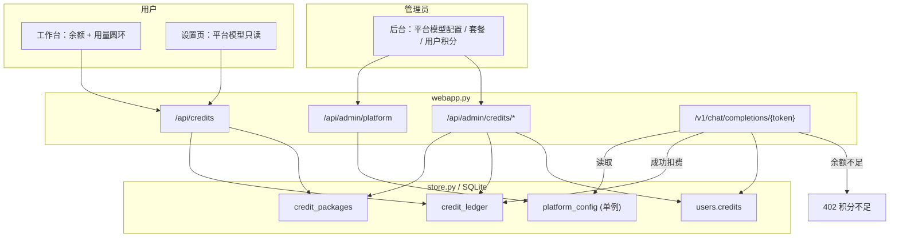

# 积分套餐与按轮计费（Credit Billing）技术设计

Feature Name: credit-billing
Updated: 2026-09-14

## Description

在「念念 Nian」多租户平台之上引入统一供模与积分计费：

- 平台模型配置从环境变量迁入数据库，由管理员在后台维护，用户侧移除 API Key 输入。
- 新增积分账户、额度流水与套餐档位；新用户注册赠送初始积分。
- 聊天回复路径在成功调用模型后按轮扣减固定积分，余额不足则在调用前拒绝。
- 用户工作台与设置页展示积分余额与用量圆环；管理员后台展示并管理用户积分。

设计目标：

- **单一供模来源**：所有聊天回复统一走 `build_config`，平台配置为唯一权威来源。
- **计费可预期**：按轮固定扣费，成功才扣、失败不扣、缓存命中不扣。
- **余额安全**：并发下余额非负，扣费与流水在同一事务内完成。
- **最小侵入**：复用现有 `platform_usage`、`admin_audit`、`crypto`、`settings_kv` 式
  的持久化与审计能力，不改动 `agent`/`llm` 的调用协议。

## Architecture



计费与扣费都收敛在 `/v1/chat/completions/{token}` 这一个回复入口；微信桥接与工作台
调试复用同一入口，避免出现两条计费逻辑。

## Components and Interfaces

### backend / store.py

- `get_platform_config() -> dict`：读取 `platform_config` 单例；缺省记录时以环境变量
  `PERSONA_PLATFORM_*` 作为初始播种值返回（只读兜底）。
- `set_platform_config(api_key_encrypted, base_url, model, enabled, per_turn_cost,
  new_user_gift) -> None`：UPSERT 单例配置。
- `get_credits(user_id) -> int`：读取用户余额。
- `grant_credits(user_id, delta, reason, actor, ref="") -> dict`：在单事务内读取余额、
  校验非负、更新余额、写入 `credit_ledger`，返回 `{balance, delta}`。
- `deduct_credits(user_id, amount, reason, ref) -> dict`：`grant_credits` 的负向封装，
  余额不足时抛出 `InsufficientCredits`。
- `credits_summary(user_id) -> dict`：返回 `{balance, used, granted, ratio}`，其中
  `used` 为负向流水绝对值之和，`granted` 为正向流水之和。
- `list_credit_ledger(user_id, limit=20) -> list[dict]`。
- `list_credit_packages(active_only=True) -> list[dict]` / `upsert_credit_package(...)`。

### backend / config.py

- `load_platform_config()` 改为优先读取数据库单例，读不到时回退环境变量，保持现有
  `PlatformConfig` 结构（新增 `enabled`、`per_turn_cost`、`new_user_gift` 字段）。

### backend / webapp.py

- `build_config(user_id, persona)`：平台配置启用时返回 `LLMConfig(platform=True)`；
  用户自带 Key 分支保留代码路径但不再从 UI 暴露。
- 聊天回复入口：在 `get_agent` 之后、调用 `agent.reply` 之前做余额预检；成功返回后
  扣费并写流水。
- 用户接口：
  - `GET /api/credits` → `{balance, packages, usages, per_turn_cost, ledger}`。
- 管理员接口：
  - `GET /api/admin/platform` / `PUT /api/admin/platform`（Key 可选，空值表示不变）。
  - `GET /api/admin/credits/summary`（发放总量、消耗总量、持有总量）。
  - `POST /api/admin/users/{user_id}/credits` body `{delta, reason}`。
  - `GET /api/admin/users`（扩展返回 `credits`）。
  - `GET /api/admin/packages` / `PUT /api/admin/packages/{id}`。
- 注册流程：`register` 成功后按 `new_user_gift` 发放初始积分（R6–R8）。

### frontend

- `web/app.html`：工作台顶部新增积分卡片，含用量圆环（SVG 双环 + 中心余额）。
- `web/settings.html`：模型区改为只读「平台提供」，新增积分余额、用量圆环、套餐列表
  与最近流水；移除 Key 输入与保存按钮。
- `web/admin.html`：新增「模型与积分」标签页，含平台模型表单、计费参数、套餐编辑、
  用户积分发放；用户表新增积分列。
- `web/static/app.js`：新增 `creditRing(el, ratio, label)` 渲染函数，供工作台与设置页
  复用。

## Data Models

```sql
ALTER TABLE users ADD COLUMN credits INTEGER NOT NULL DEFAULT 0;

CREATE TABLE IF NOT EXISTS platform_config (
    id INTEGER PRIMARY KEY CHECK (id = 1),
    api_key_encrypted TEXT NOT NULL DEFAULT '',
    base_url TEXT NOT NULL DEFAULT 'https://api.deepseek.com/v1',
    model TEXT NOT NULL DEFAULT 'deepseek-chat',
    enabled INTEGER NOT NULL DEFAULT 0,
    per_turn_cost INTEGER NOT NULL DEFAULT 1,
    new_user_gift INTEGER NOT NULL DEFAULT 100,
    updated_at TEXT NOT NULL
);

CREATE TABLE IF NOT EXISTS credit_packages (
    id INTEGER PRIMARY KEY AUTOINCREMENT,
    name TEXT NOT NULL,
    credits INTEGER NOT NULL,
    price_cents INTEGER NOT NULL DEFAULT 0,
    badge TEXT NOT NULL DEFAULT '',
    sort INTEGER NOT NULL DEFAULT 0,
    active INTEGER NOT NULL DEFAULT 1,
    created_at TEXT NOT NULL,
    updated_at TEXT NOT NULL
);

CREATE TABLE IF NOT EXISTS credit_ledger (
    id INTEGER PRIMARY KEY AUTOINCREMENT,
    user_id INTEGER NOT NULL,
    delta INTEGER NOT NULL,
    balance_after INTEGER NOT NULL,
    reason TEXT NOT NULL DEFAULT '',
    actor TEXT NOT NULL DEFAULT '',
    ref TEXT NOT NULL DEFAULT '',
    created_at TEXT NOT NULL
);
CREATE INDEX IF NOT EXISTS idx_credit_ledger_user ON credit_ledger(user_id, id);
```

套餐种子数据（幂等插入，仅在表为空时）：

| 名称 | 积分 | 价格(分) | 徽标 | 排序 |
|------|------|----------|------|------|
| 体验包 | 100 | 0 | | 1 |
| 标准包 | 1000 | 9900 | 推荐 | 2 |
| 尊享包 | 5000 | 39900 | 超值 | 3 |

## Correctness Properties

1. **余额非负**：任意时刻 `users.credits >= 0`；`deduct_credits` 在余额不足时失败且
   不写入任何流水。
2. **流水一致**：对每个用户，`sum(ledger.delta) == users.credits`。
3. **成功才扣**：一次回复仅在模型调用成功且未命中缓存时产生一条 `delta == -per_turn_cost`
   的流水。
4. **单价为零免费**：`per_turn_cost == 0` 时不产生扣费流水。
5. **配置原子生效**：平台配置写入后，清理 `_agents` 与 `llm._clients`，下一请求使用新值。
6. **比例有界**：`usage.ratio` 取值于 `[0, 1]`；`granted == 0` 时为 `0`。

## Error Handling

| 场景 | 处理 |
|------|------|
| 平台模型未启用 | 回复返回 400，`detail="平台模型尚未启用"`，计数 `reply.platform_disabled` |
| 余额不足 | 回复返回 402，`detail="积分不足，请购买套餐"`，不入库、不扣费 |
| 微信入站余额不足 | 返回积分不足的可读文本回复，计数 `reply.insufficient_credits` |
| 模型调用失败 | 保持现有错误处理，不扣费 |
| 管理员扣减超过余额 | 返回 400，`detail="余额不足，无法扣减"` |
| 平台 Key 为空 | `load_platform_config().ready == False`，`enabled` 视为未启用 |

## Test Strategy

- **store 单元测试**：`grant_credits` / `deduct_credits` 的余额、流水、非负约束；并发
  `deduct` 不产生负余额。
- **接口测试**：注册赠分；`GET /api/credits` 结构；管理员发放与扣减；平台配置读写后
  `build_config` 生效。
- **计费路径测试**：模拟成功回复扣分、缓存命中不扣、失败不扣、余额不足拒绝、单价为 0
  不扣。
- **前端**：`creditRing` 在 `ratio=0/0.5/1` 的 SVG 输出快照；`node --check` 校验内联脚本。
- 回归：现有 133 项测试保持通过，`platform_usage` 计数逻辑不变。

## 补充设计：念念币与兑换码（2026-09-14）

两层货币：`users.coins`（念念币钱包）与 `users.credits`（聊天额度）。念念币仅由兑换码
或管理员调整发放；套餐以念念币定价并发放聊天额度；聊天按轮扣减聊天额度。

新增数据结构：

```sql
ALTER TABLE users ADD COLUMN coins INTEGER NOT NULL DEFAULT 0;
ALTER TABLE credit_packages ADD COLUMN coins INTEGER NOT NULL DEFAULT 0;

CREATE TABLE IF NOT EXISTS coin_ledger (
    id INTEGER PRIMARY KEY AUTOINCREMENT,
    user_id INTEGER NOT NULL,
    delta INTEGER NOT NULL,
    balance_after INTEGER NOT NULL,
    reason TEXT NOT NULL DEFAULT '',
    actor TEXT NOT NULL DEFAULT '',
    ref TEXT NOT NULL DEFAULT '',
    created_at TEXT NOT NULL
);
CREATE TABLE IF NOT EXISTS redemption_codes (
    id INTEGER PRIMARY KEY AUTOINCREMENT,
    code TEXT NOT NULL UNIQUE,
    coins INTEGER NOT NULL,
    batch TEXT NOT NULL DEFAULT '',
    note TEXT NOT NULL DEFAULT '',
    status TEXT NOT NULL DEFAULT 'unused',
    created_by TEXT NOT NULL DEFAULT '',
    created_at TEXT NOT NULL,
    redeemed_by INTEGER,
    redeemed_at TEXT NOT NULL DEFAULT ''
);
```

数据层新增：`get_coins`、`grant_coins`、`coins_summary`、`list_coin_ledger`、
`coins_totals`、`purchase_package`、`create_redemption_codes`、`list_redemption_codes`、
`redemption_stats`、`redeem_code`；异常 `InsufficientCoins`、`RedemptionError`。
`upsert_credit_package` 增加 `coins` 参数（默认 0，向后兼容）。

接口层：

| 方法 | 路径 | 说明 |
|------|------|------|
| GET | `/api/credits` | 返回聊天额度 + 念念币余额/流水 + 套餐 |
| POST | `/api/redeem` | 用户兑换码兑换念念币 |
| POST | `/api/packages/{id}/purchase` | 用念念币购买套餐 |
| GET/POST | `/api/admin/redemption-codes` | 兑换码列表 / 批量生成 |
| POST | `/api/admin/users/{id}/coins` | 管理员调整念念币 |
| GET | `/api/admin/credits` | 增加 `coins_totals`、`redemption` |

正确性补充：`purchase_package` 与 `redeem_code` 在单事务内完成；兑换码一次性使用；
念念币与聊天额度分别校验非负；`sum(coin_ledger.delta) == users.coins`。

套餐种子改为以念念币定价：体验包 100 额度/10 币、标准包 1000 额度/90 币（推荐）、
尊享包 5000 额度/400 币（超值）；存量按名称回填 `coins`。

## References

[^1]: (Filename#L468) - [build_config](/workspace/ex_persona/webapp.py)
[^2]: (Filename#L55) - [load_platform_config](/workspace/ex_persona/config.py)
[^3]: (Filename#L1342) - [platform_usage](/workspace/ex_persona/store.py)
[^4]: (Filename#L1977) - [route_chat](/workspace/ex_persona/webapp.py)
[^5]: (Filename#L2189) - [admin endpoints](/workspace/ex_persona/webapp.py)
