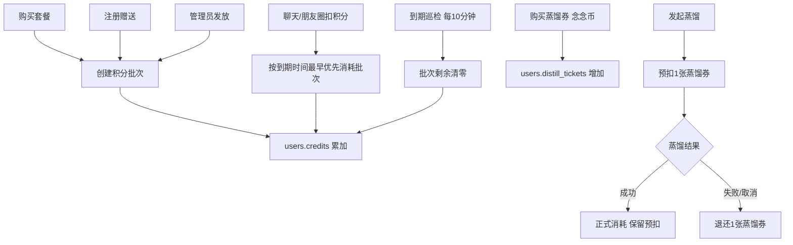

# 设计文档：积分套餐有效期与蒸馏单独购买

- Feature: `credit-expiry-distill`
- 日期: 2026-09-17
- 关联需求: `.monkeycode/specs/2026-09-17-credit-expiry-distill/requirements.md`
- 状态: 待实施

## 1. 总览

把积分从「`users.credits` 单一永久余额」升级为「`credit_batches` 按批次记账 + 可按批次到期
清零」，并新增独立的「蒸馏券（distill ticket）」用于蒸馏计费。

核心原则：

- `users.credits` 仍是**可用余额的唯一读取来源**（保证所有既有读路径零改动）。
- `credit_batches` 是**到期语义的唯一真相来源**；`users.credits` 必须恒等于全部未到期批次
  `remaining` 之和。
- 所有积分（套餐 / 赠送 / 管理员发放）都带 `expires_at`，不存在永久积分。
- 蒸馏券与积分完全独立，用念念币购买；**蒸馏成功才最终消耗**，失败退还。



## 2. 数据模型

### 2.1 新增表 `credit_batches`

```sql
CREATE TABLE IF NOT EXISTS credit_batches (
    id INTEGER PRIMARY KEY AUTOINCREMENT,
    user_id INTEGER NOT NULL,
    amount INTEGER NOT NULL,              -- 发放总量
    remaining INTEGER NOT NULL,           -- 未消耗剩余量（到期后为 0）
    source TEXT NOT NULL DEFAULT 'gift',  -- package | gift | admin
    package_id INTEGER,                   -- 套餐来源
    reason TEXT NOT NULL DEFAULT '',      -- 展示文案，如「套餐到账：标准包」
    actor TEXT NOT NULL DEFAULT '',
    ref TEXT NOT NULL DEFAULT '',         -- package:<id> / register / admin:<name>
    expires_at TEXT NOT NULL,             -- UTC ISO8601，全部非空
    reminded_at TEXT NOT NULL DEFAULT '', -- 到期提醒发送时间，空表示未提醒
    expired_at TEXT NOT NULL DEFAULT '',  -- 实际清零时间，空表示未清零
    created_at TEXT NOT NULL
);
CREATE INDEX IF NOT EXISTS idx_credit_batches_user ON credit_batches(user_id, expires_at, id);
CREATE INDEX IF NOT EXISTS idx_credit_batches_live ON credit_batches(remaining, expires_at);
```

`source` 取值固定为 `package` / `gift` / `admin`，用于流水与审计展示。

### 2.2 新增表 `distill_ticket_ledger`

```sql
CREATE TABLE IF NOT EXISTS distill_ticket_ledger (
    id INTEGER PRIMARY KEY AUTOINCREMENT,
    user_id INTEGER NOT NULL,
    delta INTEGER NOT NULL,
    balance_after INTEGER NOT NULL,
    reason TEXT NOT NULL DEFAULT '',
    actor TEXT NOT NULL DEFAULT '',
    ref TEXT NOT NULL DEFAULT '',
    created_at TEXT NOT NULL
);
CREATE INDEX IF NOT EXISTS idx_distill_ticket_ledger_user ON distill_ticket_ledger(user_id, id);
```

`reason` 取值：`蒸馏券购买`、`蒸馏预扣`、`蒸馏失败退还`、`管理员发放`、`管理员扣减`。
蒸镏成功时不写新流水（预扣即最终消耗），`消耗数 = count(蒸馏预扣) - count(蒸馏失败退还)`。

### 2.3 迁移（`_MIGRATIONS` 扩展）

```python
"users": {
    ...,
    "distill_tickets": "INTEGER NOT NULL DEFAULT 0",
},
"credit_packages": {
    "coins": "INTEGER NOT NULL DEFAULT 0",
    "validity_days": "INTEGER NOT NULL DEFAULT 30",
},
"platform_config": {
    "default_credit_days": "INTEGER NOT NULL DEFAULT 30",
    "distill_ticket_price": "INTEGER NOT NULL DEFAULT 60",
    "distill_ticket_gift": "INTEGER NOT NULL DEFAULT 0",
},
```

同时新增 `schema_meta(key TEXT PRIMARY KEY, value TEXT NOT NULL)`，用于记录一次性迁移标记。

### 2.4 历史余额清空（一次、幂等，R28/R29）

在 `init_db()` 补列完成后执行：

```python
if _meta_get(conn, "credit_expiry_migrated") != "1":
    for user in conn.execute("SELECT id, credits FROM users WHERE credits > 0"):
        conn.execute(
            "UPDATE users SET credits = 0 WHERE id = ?", (user["id"],))
        conn.execute(
            "INSERT INTO credit_ledger (user_id, delta, balance_after, reason, actor, ref,"
            " created_at) VALUES (?, ?, 0, ?, 'system', 'credit-expiry-migration', ?)",
            (user["id"], -int(user["credits"]), "历史余额清空（有效期机制上线）", now))
    _meta_set(conn, "credit_expiry_migrated", "1")
```

- 幂等由 `schema_meta` 标记保证，重复启动不再执行。
- 用 `UPDATE ... WHERE credits > 0` 与标记同事务，避免并发重复。

### 2.5 存量套餐有效期补齐

新列 `validity_days` 默认 30，`added_columns` 命中 `("credit_packages", "validity_days")` 时，
把三个默认套餐按档位补齐：体验包 30、标准包 90、尊享包 365（仅对 `validity_days = 30` 且名称
匹配的存量行生效，避免管理员自定义后被覆盖）。

## 3. 核心算法

### 3.1 发放积分 `grant_credits` 扩展

签名新增 `expires_days: int | None = None`、`source: str = "gift"`、`package_id: int | None = None`：

- `delta > 0`：解析有效期 `days = expires_days or platform.default_credit_days`，校验
  `days in (30, 90, 365)`；`expires_at = utcnow() + timedelta(days=days)`；插入批次；
  再 `UPDATE users SET credits = credits + delta`；写 `credit_ledger`（沿用现有原子 SQL 与幂等）。
- `delta < 0`：调用 `_consume_batches(conn, user_id, -delta)` 从最早到期批次优先扣减；余额
  不足抛 `InsufficientCredits`。
- `delta == 0`：保持现状（幂等分支返回，不写流水）。

### 3.2 批次消耗 `_consume_batches(conn, user_id, amount)`

```sql
SELECT id, remaining FROM credit_batches
 WHERE user_id = ? AND remaining > 0 AND expires_at > ?
 ORDER BY expires_at, id
```

按序扣减，返回实际扣减量；`UPDATE credit_batches SET remaining = remaining - ? WHERE id = ?`。
不变量：调用前 `users.credits >= amount`，调用后 `SUM(remaining) == users.credits`。

### 3.3 到期清零巡检 `expire_credit_batches(now=None) -> dict`

```sql
SELECT id, user_id, remaining FROM credit_batches
 WHERE remaining > 0 AND expires_at <= ? AND expired_at = ''
```

逐条：`remaining = 0`、`expired_at = now`、`UPDATE users SET credits = credits - remaining`
（`WHERE credits >= remaining`，异常则记日志并跳过，不产生负余额）、写 `credit_ledger`
（delta 为负、reason `积分到期清零`、ref 批次 id），返回 `{"expired_batches": n, "expired_credits": m}`。
R9：`remaining == 0` 的批次已被查询条件排除，不写流水。

### 3.4 到期提醒 `remind_expiring_batches(now=None, window_hours=72) -> dict`

```sql
SELECT id, user_id, remaining, expires_at FROM credit_batches
 WHERE remaining > 0 AND expired_at = '' AND reminded_at = ''
   AND expires_at > ? AND expires_at <= ?
```

对每条调用站内通知（复用现有通知/消息写入方式），成功后置 `reminded_at = now`。同批次只提醒
一次（R15）。是否在推送通道已断开时降级为仅站内记录：是，仅写站内。

### 3.5 后台巡检线程 `CreditExpiryWorker`

- 与现有 `MomentScheduler` 相同模式：`threading.Thread(daemon=True)`，`start()` / `stop()`。
- 事件等待驱动，每 `interval=600s`（≤1h，满足 R13）执行一次
  `expire_credit_batches()`，再执行 `remind_expiring_batches()`。
- 在 `webapp` 应用启动处（与朋友圈调度器同处）启动；测试中可注入 `now` 与不启动线程。
- 异常只记日志，绝不终止循环。

### 3.6 蒸馏券

- `grant_distill_tickets(user_id, delta, reason, actor="", ref="", idem="")`：与
  `grant_coins` 同构（`_lock` 单事务、非负约束、幂等 scope `distill.grant`），余额列
  `users.distill_tickets`。
- `distill_tickets_summary(user_id)`：返回 `{balance, purchased, consumed, price}`。
- `purchase_distill_ticket(user_id, quantity=1, idem="")`：单事务内按
  `platform_config.distill_ticket_price` 扣念念币 + 增加券 + 双流水（`coin_ledger` 与
  `distill_ticket_ledger`），幂等 scope `distill.purchase`，`InsufficientCoins` 时整体回滚。
- `reserve_distill_ticket(user_id, task_id)`：`balance > 0` 才 `-1`，ref = `task:<id>`，
  reason `蒸馏预扣`；否则抛 `InsufficientDistillTickets`。
- `refund_distill_ticket(user_id, task_id, reason="蒸馏失败退还")`：+1，幂等键
  `distill.refund:<task_id>`，同一任务只退一次。
- `reconcile_distill_tickets()`：启动时扫描 `tasks` 中 `kind in (distill, redistill)` 且
  `status in (queued, running)` 的任务，退还其预扣券并置任务为 `error`（`error_kind="interrupted"`），
  防止进程重启导致券被永久占用。

## 4. API 设计

### 4.1 用户端

| 方法 | 路径 | 说明 |
|------|------|------|
| GET | `/api/credits` | 扩展返回：`batches`（最近到期时间、即将清零积分数）、`packages[].validity_days`、`distill_tickets`（余额、单价、可购数量） |
| POST | `/api/distill-tickets/purchase` | body `{quantity, client_id}`；用念念币购买蒸馏券；`402` 余额不足 |
| POST | `/api/personas/distill` | 现有；发起前 `reserve_distill_ticket`，无券返回 `402`「需要先购买蒸馏券」 |
| POST | `/api/personas/{id}/redistill` | 同上 |
| POST | `/api/personas/from-preset` | 不扣券（R23） |
| GET | `/api/distill-tickets` | 余额 + 流水（可选，或合并进 `/api/credits`） |

`_run_distill_task`：

- 成功分支（含 `use_llm=False`、空素材空跑分支）：保留预扣券。
- 所有 `except` 分支：`refund_distill_ticket`（幂等）。
- `client_id` 重试分支（`status == "error"` 重新起线程）在起线程前同样 `reserve_distill_ticket`；
  `status == "running"` 的复用分支不重复预扣。

### 4.2 管理端

| 方法 | 路径 | 变更 |
|------|------|------|
| POST | `/api/admin/packages` | `PackageRequest` 新增 `validity_days`（30/90/365，非法 400） |
| POST | `/api/admin/users/{id}/credits` | `CreditGrantRequest` 新增 `credit_days`；`delta > 0` 必填且合法，`delta < 0` 忽略 |
| PUT | `/api/admin/platform` | `PlatformConfigRequest` 新增 `default_credit_days`、`distill_ticket_price`、`distill_ticket_gift` |
| GET | `/api/admin/credits` | 返回持有/已用/累计；新增 `expired` 汇总（`credit_ledger` 中 `reason = 积分到期清零`） |

## 5. 前端设计

- `web/settings.html` 钱包页：
  - 积分卡增加「最近到期 YYYY-MM-DD · 即将清零 N」行（无批次则不显示）。
  - 套餐卡片显示「有效期 30/90/365 天 · 到期未用部分清零」。
  - 新增「蒸馏券」区块：剩余数量、单价（念念币）、购买按钮、流水折叠列表。
- `web/app.html` 首页积分卡：复用 `renderCredits`，增加到期提示行（仅当 `expiring_soon > 0`
  或存在 `next_expiry`）。
- 创建分身流程：顶部显示蒸馏券数量；为 0 时按钮置灰并提示「先购买蒸馏券」；发起后提示
  「已预扣 1 张蒸馏券，失败自动退还」。
- 后台 `web/admin.html`：套餐表单加有效期下拉；平台表单加默认积分天数、蒸馏券单价 / 赠送数；
  发放积分弹窗加有效期下拉；积分看板加「到期清零」汇总。
- 全部沿用现有液态玻璃与 SVG 图标规范，无 emoji。

## 6. 不变量与并发

- 不变量 I1：`users.credits == SUM(credit_batches.remaining WHERE expired_at = '')`。
- 不变量 I2：所有 `credit_batches.remaining >= 0`、`users.credits >= 0`。
- 不变量 I3：单个 `task_id` 的蒸馏预扣最多退还一次。
- 所有涉及批次与券的写操作都在 `store._lock` + 单 `connect()` 事务内完成；非负约束放在
  `UPDATE ... WHERE x + delta >= 0` 内，避免跨连接丢更新。
- 幂等 scope 新增：`distill.purchase`、`distill.grant`、`distill.refund:<task_id>`；
  积分沿用 `credits.grant`、`package.purchase`。

## 7. 错误处理

- 无券发起蒸馏：`402`，`detail="蒸馏券不足，请先购买蒸馏券"`。
- 念念币不足购买券：`402`，走既有 `InsufficientCoins` 映射。
- 非法 `validity_days` / `credit_days`：`400`，`detail="有效期仅支持 30/90/365 天"`。
- 巡检线程异常：`log.warning` 记录 `event=credit.expire.error`，跳过该批次继续。
- 余额与批次不一致（升级/异常数据）：巡检只清 `remaining > 0` 的批次，且 `credits >= remaining`
  才扣；不一致时记 `event=credit.batch.mismatch` 并跳过，绝不产生负余额。

## 8. 测试策略

- `tests/test_credit_batches.py`（新增）：
  - 发放生成正确 `expires_at`；非法天数报错。
  - 扣减按最早到期优先；跨批次扣减；余额不足不变更。
  - 到期清零：清零金额、流水、幂等（重复巡检不重复清零）、不变量 I1。
  - 72h 提醒：窗口内一次、窗口外不提醒、重复巡检不重复提醒。
  - 迁移：历史余额清零一次且幂等；`schema_meta` 标记生效。
- `tests/test_distill_tickets.py`（新增）：
  - 购买成功/币不足回滚；幂等防重复购买。
  - 预扣/成功保留/失败退还；同任务退款幂等。
  - `reconcile` 处理中断任务。
- `tests/test_credits.py`（既有）：适配新签名，补充套餐 `validity_days`、`/api/credits`
  新字段、admin 发放带 `credit_days`、admin 套餐校验。
- `tests/test_moments_api.py`：适配 `new_user_gift=0` 下的批次发放。
- e2e `scripts/e2e/run_chain.py`：新增「买券 → 蒸馏成功扣券 → 重蒸馏扣券 → 套餐到期展示」链路。
- 前端 jsdom 探针：`render_settings.js`（钱包/蒸馏券区块）、`render_credit_card.js`（到期行）。

## 9. 发布与回滚

- 迁移为纯新增列 + 新增表，`init_db()` 自动完成；无破坏性 DDL。
- 历史余额清空是唯一不可逆操作，执行前先备份生产 DB（`/opt/nian/backups/`），并在部署日志
  中打印被清零的用户数与总额。
- 回滚：代码回退后旧版本忽略新增列与批次表；但已清零余额不会自动恢复，需从部署前备份恢复
  `platform.db`。
- 部署仍走 `/tmp/opencode/deploy_credit.sh`（web + ex_persona），验证项：
  `/api/credits` 含 `batches` 与 `distill_tickets`；买券扣币；无券蒸馏返回 402；巡检日志出现
  `credit.expire` 事件。
