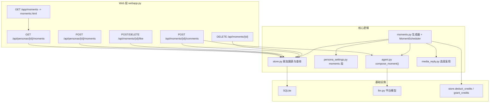

# 分身朋友圈（Persona Moments）技术设计

Feature Name: persona-moments
Updated: 2026-09-17

## 描述

为每个分身提供独立的私密朋友圈：分身在后台按节奏自动发布日常动态，用户可浏览、
点赞、评论，分身对评论作出回应。动态内容基于人格档案与长期记忆生成，配图复用分身
素材库。自动发布与评论回应均按轮扣减积分。

需求依据：`.monkeycode/specs/2026-09-17-persona-moments/requirements.md`。

## 已确认决策

1. 入口：底部导航新增第 5 个「朋友圈」tab（`/app/moments`）。
2. 默认节奏：默认关闭；开启后每日上限 2 条、最小间隔 180 分钟，时间窗沿用主动消息。
3. 积分不足：自动发布跳过本次，提醒中心每天最多提醒一次，充值后自动恢复。

## 架构



调度器复用 `ProactiveScheduler` 的后台线程模型：独立 `MomentScheduler` 按 300 秒轮询
一次，遍历开启朋友圈的人格，判断时间窗、每日上限与最小间隔后生成并落库。生成与聊天
共用同一个人格 Agent（`_agent_factory`），保证语气一致。

## 组件与接口

### store.py 新增

```python
def add_moment(user_id, persona_id, content, sticker_id=0, source="auto") -> dict
def get_moment(user_id, moment_id) -> dict | None
def list_moments(user_id, persona_id, limit=20, before_id=0) -> list[dict]   # 倒序游标分页
def count_moments_on(persona_id, day) -> int                                # 当日发布数
def last_moment_at(persona_id) -> str                                       # 最近发布时间
def delete_moment(user_id, moment_id) -> bool                               # 级联点赞/评论
def set_moment_like(moment_id, user_id, liked) -> bool                      # 幂等
def list_moment_comments(moment_id) -> list[dict]
def add_moment_comment(moment_id, user_id, content) -> dict
def set_moment_comment_reply(comment_id, reply, status) -> bool
```

`list_moments` 返回每条动态附带 `like_count`、`comment_count`、`liked`（当前用户是否
已赞），由一次 `LEFT JOIN` + 聚合查询产出，避免 N+1。

### persona_settings.py 新增段

```python
"moments": {
    "enabled": False,
    "max_per_day": 2,
    "min_gap_minutes": 180,
    "prompt": "",
},
```

时间窗复用 `proactive.window_start` / `window_end`（需求 R19）。`validate()` 收敛
`max_per_day` 到 1~10，`min_gap_minutes` 到 30~1440，`prompt` 截断到 200 字。

### moments.py 新增

```python
MOMENT_PROMPT = "..."
MOMENT_STYLE_RULES = "..."          # 与 CHAT_STYLE_RULES 分离，朋友圈不是对话

def build_prompt(settings: dict, memories: list[dict]) -> str
def compose(agent, settings, memories) -> str        # 返回正文，可带 [[IMAGE]] 标记
class MomentScheduler:
    def start() / stop()
    def tick(now=None)
```

`compose` 调用 `agent.compose_moment(prompt)`，再复用
`media_reply.parse_reply` 与 `media_reply.choose_media` 从 `store.list_stickers`
中挑一张配图。

### agent.py 新增方法

```python
def compose_moment(self, extra_context="", temperature=None, max_tokens=None) -> str
```

系统提示由「人设 SKILL + 记忆背景 + `MOMENT_STYLE_RULES`」组成，不含聊天记录，避免
把微信对话口吻带进朋友圈。内部复用抽出的 `_generate_and_clean()`，与 `reply()` 共享
乱码重采与提示词泄漏过滤逻辑。

### webapp.py 新增路由

| 方法 | 路径 | 说明 |
|------|------|------|
| GET | `/app/moments` | 朋友圈页面 |
| GET | `/api/personas/{persona_id}/moments` | 游标分页列表，参数 `before_id`、`limit` |
| POST | `/api/personas/{persona_id}/moments` | 手动发布一条，按轮扣费 |
| DELETE | `/api/moments/{moment_id}` | 删除动态并级联 |
| POST | `/api/moments/{moment_id}/like` | 点赞，幂等 |
| DELETE | `/api/moments/{moment_id}/like` | 取消点赞 |
| GET | `/api/moments/{moment_id}/comments` | 评论列表 |
| POST | `/api/moments/{moment_id}/comments` | 发表评论并按轮扣费，随后生成分身回应 |
| POST | `/api/moments/comments/{comment_id}/retry` | 回应失败后重试 |

所有动态级接口通过 `store.get_moment(user["id"], moment_id)` 校验归属，未命中返回
404（需求 R3）。CSRF 由现有中间件统一处理。

### 前端

- 新增 `web/moments.html`：顶部分身切换（复用 `/api/personas`），动态卡片列表，点赞、
  评论、删除，空状态与「让 ta 发一条」按钮。图标用 `app.js` 的 `icon()`，命名空间
  样式写入页内 `<style>`。
- `web/static/app.js`：`NAV_ITEMS` 增加 `{ href: "/app/moments", label: "朋友圈" }`，
  并补充一个 `moments` SVG 图标。
- `web/settings.html`：在人格设置中增加朋友圈开关、每日上限、生成提示词三项。

## 数据模型

```sql
CREATE TABLE IF NOT EXISTS moments (
    id INTEGER PRIMARY KEY AUTOINCREMENT,
    user_id INTEGER NOT NULL,
    persona_id INTEGER NOT NULL,
    content TEXT NOT NULL,
    sticker_id INTEGER NOT NULL DEFAULT 0,
    source TEXT NOT NULL DEFAULT 'auto',
    created_at TEXT NOT NULL
);
CREATE INDEX IF NOT EXISTS idx_moments_persona ON moments(persona_id, id);

CREATE TABLE IF NOT EXISTS moment_likes (
    id INTEGER PRIMARY KEY AUTOINCREMENT,
    moment_id INTEGER NOT NULL,
    user_id INTEGER NOT NULL,
    created_at TEXT NOT NULL,
    UNIQUE(moment_id, user_id)
);
CREATE INDEX IF NOT EXISTS idx_moment_likes_moment ON moment_likes(moment_id);

CREATE TABLE IF NOT EXISTS moment_comments (
    id INTEGER PRIMARY KEY AUTOINCREMENT,
    moment_id INTEGER NOT NULL,
    user_id INTEGER NOT NULL,
    content TEXT NOT NULL,
    reply TEXT NOT NULL DEFAULT '',
    reply_status TEXT NOT NULL DEFAULT 'pending',
    created_at TEXT NOT NULL,
    updated_at TEXT NOT NULL
);
CREATE INDEX IF NOT EXISTS idx_moment_comments_moment ON moment_comments(moment_id, id);
```

`reply_status` 取值 `pending` / `done` / `failed`。新建表由 `init_db()` 的
`executescript(SCHEMA)` 自动创建，无需迁移列。

## 正确性属性

- 归属不变式：任一动态、点赞、评论的 `user_id` 必须与其所属人格的 `user_id` 一致。
- 计费不变式：每条成功发布的动态（含评论回应）恰好对应一次 `deduct_credits`；生成
  失败必须退款，净扣费为 0。
- 点赞幂等：`UNIQUE(moment_id, user_id)` 保证重复点赞不产生重复行。
- 级联不变式：删除动态后，其 `moment_likes` 与 `moment_comments` 无残留。
- 上限不变式：单人格单日自动发布数不超过 `max_per_day`。
- 防泄漏：生成正文经 `clean_reply` 与 `looks_garbled` 校验，命中系统文字或乱码则丢弃。

## 错误处理

| 场景 | 处理 |
|------|------|
| 人格未开启朋友圈或平台模型未就绪 | 调度器静默跳过，不报错（R6） |
| 积分不足（自动发布） | 跳过本次并退款前置扣费，每天最多提醒一次（R23） |
| 模型调用失败 / 输出为空或乱码 | 退款，不落库，记录 `observability` 指标与日志 |
| 积分不足（用户评论） | 返回 402 类提示，拒绝保存评论（R15） |
| 分身回应生成失败 | 保留评论，`reply_status='failed'`，提供重试接口（R16） |
| 跨用户访问动态 | 返回 404，不泄露存在性（R3） |

## 测试策略

- `tests/test_moments.py`（新增）：
  - store：增删查、游标分页、点赞幂等、级联删除、当日计数、跨用户隔离。
  - `moments.compose`：伪造 Agent，验证泄漏与乱码过滤、配图挑选。
  - `MomentScheduler.tick`：关闭/窗口外/达上限时跳过；积分不足时跳过并提醒一次；
    生成失败时退款且不落库；成功时扣费一次。
  - API：跨用户 404、手动发布扣费、评论扣费 + 回应、积分不足拒绝评论、重试接口。
  - `persona_settings.validate`：`moments` 段收敛。
- e2e：`scripts/e2e/run_chain.py` 增加「发布 -> 列表 -> 点赞 -> 评论 -> 回应 -> 删除」
  链路。
- 回归命令：`python3 -m unittest discover -s tests`、`ruff check ex_persona tests`、
  `python3 scripts/e2e/run_chain.py`。

## 参考

- [^1]: (Filename#L37) - 人格表结构 [store.py](../../../ex_persona/store.py)
- [^2]: (Filename#L111) - 主动消息调度器 [scheduler.py](../../../ex_persona/scheduler.py)
- [^3]: (Filename#L13) - 人格设置默认值与校验 [persona_settings.py](../../../ex_persona/persona_settings.py)
- [^4]: (Filename#L156) - Agent 回复与系统提示 [agent.py](../../../ex_persona/agent.py)
- [^5]: (Filename#L24) - 媒体标记解析与选图 [media_reply.py](../../../ex_persona/media_reply.py)
- [^6]: (Filename#L1967) - 积分发放与扣减 [store.py](../../../ex_persona/store.py)
- [^7]: (Filename#L311) - 底部导航定义 [app.js](../../../web/static/app.js)
