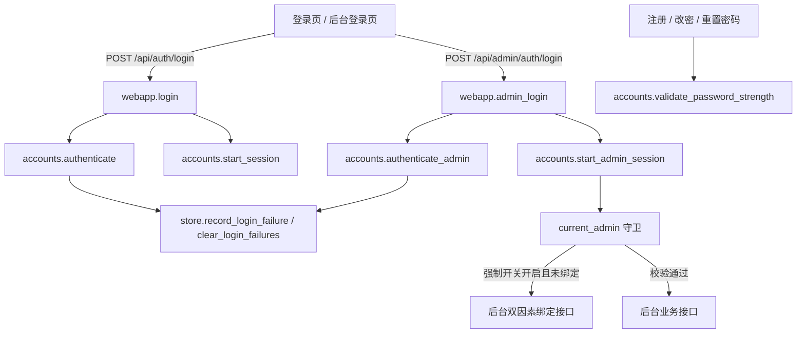

# 账号安全强化 — 技术设计

Feature Name: account-security-hardening
Updated: 2026-09-18

## Description

在既有账号体系上补齐三项能力，且不引入短信、邮件等外部依赖：

1. 统一的高强度密码策略（长度 10–128、四类字符齐全、弱密码与用户名相似拦截）。
2. 账户级登录失败锁定（15 分钟内 5 次失败锁定 15 分钟），管理员可解锁并留痕。
3. 平台可开关的管理员强制双因素：开启后管理员必须完成 TOTP 绑定与校验才能访问后台接口。

设计复用现有 TOTP、`feature_flags`、`admin_audit`、`admin_alerts` 与滑动窗口限流，只新增少量账户列与函数。

## Architecture



- 密码策略集中在 `accounts.py`，四条入口统一调用，避免各接口各写一套。
- 锁定状态落在账户表，登录路径在任何密码校验前先查锁定。
- 强制双因素用 `feature_flags` 的 `admin_force_totp` 开关控制，通过 `current_admin` 依赖统一拦截。

## Components and Interfaces

### 密码策略 `ex_persona/accounts.py`

- 常量：`PASSWORD_MIN_LENGTH = 10`、`PASSWORD_MAX_LENGTH = 128`、`PASSWORD_CLASS_RULES`（大写、小写、数字、符号）、`WEAK_PASSWORDS`。
- `validate_password_strength(password: str, username: str = "") -> None`：
  - 长度越界、缺少字符类别、命中弱密码字典、与用户名高度相似时抛出 `AccountError`，错误信息指出缺少的类别或原因。
  - 与用户名相似判定：用户名长度 ≥ 3 且 `username.lower() in password.lower()`。
- `validate_credentials(username, password)`：保留用户名校验，密码改为调用 `validate_password_strength`。
- `change_password(user_id, current, new)`、`set_username_password`、`create_admin`、`set_admin_password`：全部改为调用 `validate_password_strength`；`change_password` 额外拒绝新密码等于当前密码，并调用 `store.mark_password_changed(user_id)`。
- 新增 `check_password_strength(password, username) -> dict`：返回 `ok` 与 `problems` 列表，供前端实时提示强度要求。

### 账户锁定 `ex_persona/accounts.py` + `ex_persona/store.py`

- 常量：`LOGIN_FAILURE_WINDOW_SECONDS = 900`、`LOGIN_MAX_FAILURES = 5`、`LOGIN_LOCK_SECONDS = 900`。
- 账户表新增列：`failed_attempts INTEGER NOT NULL DEFAULT 0`、`failed_first_at TEXT NOT NULL DEFAULT ''`、`locked_until TEXT NOT NULL DEFAULT ''`。用户与管理员两张表同步扩展。
- `store.record_login_failure(kind, account_id, now) -> str`：窗口内累加，达到阈值时写入 `locked_until = now + LOGIN_LOCK_SECONDS` 并返回该时间；窗口外的历史失败先重置。
- `store.clear_login_failures(kind, account_id)`：清零失败计数与锁定。
- `store.get_lock_state(kind, account_id) -> dict`：返回 `locked`、`locked_until`、`remaining_seconds`、`failed_attempts`。
- `store.list_locked_accounts(limit)`：后台展示当前锁定中的用户与管理员。
- `store.unlock_account(kind, account_id)`：管理员解锁。
- `accounts.authenticate` / `authenticate_admin`：
  - 先查 `get_lock_state`；锁定中抛出 `AccountError("账户已临时锁定，请在 N 分钟后重试", status_code=429)`，并携带剩余秒数。
  - 密码错误时 `record_login_failure`；密码正确时 `clear_login_failures`。
  - 账户不存在时不做任何计数，保持统一「用户名或密码错误」。

### 强制双因素 `ex_persona/webapp.py` + `ex_persona/store.py`

- `FEATURE_FLAG_DEFAULTS` 新增 `admin_force_totp: 0`，纳入 `FEATURE_FLAG_KEYS`，后台系统分区可切换。
- `_admin_login_response` 增加 `setup_required` 参数，返回体在需要绑定时带 `totp_setup_required: true`。
- `admin_login`：
  - 开关开启且管理员已绑定 TOTP：保持现有待验证响应。
  - 开关开启且管理员未绑定：签发待验证会话，返回 `totp_setup_required: true`。
- 新增 `require_pending_admin` 依赖：允许携带待验证管理员会话，仅用于绑定接口。
- 新增接口：
  - `POST /api/admin/account/2fa/setup`（`require_pending_admin`）：复用 `accounts.generate_totp_secret` 与 `store.set_admin_totp(admin_id, secret, False)`。
  - `POST /api/admin/account/2fa/enable`（`require_pending_admin`）：`accounts.verify_totp` 通过后 `set_admin_totp(..., True)`、`mark_admin_session_verified`、`touch_admin_login`。
- `current_admin` 守卫：解析会话后，若 `admin_force_totp` 开启且 `admin.totp_enabled` 为假，返回 403 且 `detail="需要先启用双因素"`；该分支仅对后台业务接口生效，绑定接口使用 `require_pending_admin` 不受影响。
- `POST /api/admin/admins/{id}/totp`（已有）：重置目标管理员双因素；重置后该管理员下次登录重新进入绑定流程。

### 解锁与审计 `ex_persona/webapp.py`

- 新增 `GET /api/admin/security/locked`：返回锁定中的账户列表（类型、用户名、锁定截止、剩余秒数、失败次数）。
- 新增 `POST /api/admin/security/unlock`：入参 `{kind, id}`，调用 `store.unlock_account`，写 `_audit(admin, "security.unlock", ...)` 与目标账户的管理员提醒。
- 强制开关切换、管理员双因素重置复用现有接口，补充 `_audit` 动作 `security.force_totp` 与 `admin.reset_totp`（已存在）。

### 用户端与会话 `ex_persona/webapp.py` + 前端

- `/api/account/security` 增加 `password_policy`（长度与四类要求）、`last_password_change_at`、`lock` 状态。
- 新增 `POST /api/account/password/strength`：实时校验强度，返回 `ok` 与 `problems`。
- `POST /api/account/password` 成功后调用 `store.invalidate_other_sessions(user_id, current_token)`，仅保留当前会话。
- 前端：
  - `web/login.html` / `web/admin_login.html`：按后端返回的 `totp_required` / `totp_setup_required` 切换验证码或绑定界面；429 时展示锁定剩余时间。
  - `web/settings.html` 安全中心：展示密码强度要求、最近改密时间，改密表单实时提示缺失类别。
  - `web/admin.html` 安全分区：展示强制开关、锁定账户列表与解锁按钮、各管理员双因素状态。

## Data Models

```sql
ALTER TABLE users ADD COLUMN failed_attempts INTEGER NOT NULL DEFAULT 0;
ALTER TABLE users ADD COLUMN failed_first_at TEXT NOT NULL DEFAULT '';
ALTER TABLE users ADD COLUMN locked_until TEXT NOT NULL DEFAULT '';
ALTER TABLE users ADD COLUMN last_password_change_at TEXT NOT NULL DEFAULT '';

ALTER TABLE admins ADD COLUMN failed_attempts INTEGER NOT NULL DEFAULT 0;
ALTER TABLE admins ADD COLUMN failed_first_at TEXT NOT NULL DEFAULT '';
ALTER TABLE admins ADD COLUMN locked_until TEXT NOT NULL DEFAULT '';

-- feature_flags 新增键 admin_force_totp，默认 0
```

迁移接入 `init_db` 的补列循环，使用 `schema_meta` 幂等键 `account_security_migrated`；引用新列的索引与查询必须放在补列之后，避免老库启动报 `no such column`。

## Correctness Properties

- I1: 密码策略在注册、自助改密、管理员重置密码、管理员创建密码四条路径上行为一致。
- I2: 长度、类别、弱密码、用户名相似任一不满足时密码不被写入，原密码保持可用。
- I3: 同一用户名在窗口内第 5 次失败时进入锁定，锁定期内即使密码正确也拒绝登录。
- I4: 锁定窗口结束后登录成功即清零失败计数；管理员解锁立即清零。
- I5: 账户不存在时的响应与密码错误响应不可区分。
- I6: `admin_force_totp` 开启时，未绑定 TOTP 的管理员对后台业务接口返回 403，对绑定接口可访问。
- I7: `admin_force_totp` 关闭时，管理员登录与后台访问行为与本功能上线前一致。
- I8: 自助改密成功后，除当前会话外的其他会话失效。
- I9: 所有解锁、强制开关变更、双因素重置均写入 `admin_audit`。

## Error Handling

- 密码不合规：`400`，`detail` 说明缺少的字符类别或具体原因。
- 账户锁定：`429`，`detail="账户已临时锁定，请在 N 分钟后重试"`，响应头 `Retry-After` 为剩余秒数。
- 密码错误：`401`，统一 `detail="用户名或密码错误"`。
- 需要绑定双因素：`403`，`detail="需要先启用双因素"`；登录响应使用 `totp_setup_required: true` 区分绑定流程。
- 验证码错误：沿用现有 `401` 与滑动窗口限流。
- 解锁不存在的账户：`404`。

## Test Strategy

- `tests/test_account_security.py`（新增）：
  - 四类字符、长度边界、弱密码、用户名相似的拒绝与通过。
  - 四条改密路径共享策略一致。
  - 5 次失败锁定、锁定期内正确密码仍拒绝、窗口结束恢复、管理员解锁。
  - 自助改密后其他会话失效且当前会话保留。
- `tests/test_admin_console.py` 扩展：`admin_force_totp` 默认关闭；开启后未绑定管理员访问业务接口 403、绑定接口可用；绑定后恢复；解锁接口写审计。
- `scripts/e2e/run_chain.py`：新增弱密码注册拒绝、失败锁定与解锁、管理员强制双因素链路。
- jsdom / Playwright：登录页错误提示与锁定剩余时间、设置页密码强度提示、后台安全分区渲染。

## References

[^1]: (File) - 账号与 TOTP 实现 `ex_persona/accounts.py`
[^2]: (File) - 登录、限流与后台守卫 `ex_persona/webapp.py`
[^3]: (File) - 账户列、feature_flags、审计与提醒 `ex_persona/store.py`
[^4]: (Spec) - 多用户平台需求 `.monkeycode/specs/2026-09-13-multi-user-personas/requirements.md`
[^5]: (Spec) - 后台扩展需求 `.monkeycode/specs/2026-09-18-admin-console/requirements.md`
