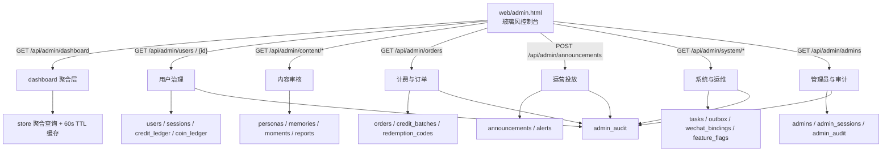

# 管理后台扩展 — 技术设计

Feature Name: admin-console
Updated: 2026-09-18

## Description

在既有单管理员后台（`web/admin.html` + `/api/admin/*`）上做一次整体扩展：

- 数据层新增订单、公告、功能开关三张表，并扩展用户与朋友圈字段。
- 接口层按模块补充只读聚合接口与写操作接口，全部沿用 `Depends(current_admin)` 与
  `admin_audit` 审计。
- 前端把后台重构为固定侧栏 + 分区面板的玻璃风控制台，复用 `app.css` 设计令牌，
  分区扩展为：概览、用户、内容、计费、运营、举报、系统、管理员。

## 本期范围（用户确认）

- 交付阶段：P0——数据层迁移、看板聚合、用户列表与详情、订单落库、后台布局重构骨架。
- 内容处置：软删除，朋友圈以 `moments.hidden` 标记，人格以 `personas.status` 标记，均支持恢复。
- 备份：仅提供备份文件列表只读接口，后端不暴露触发备份的写接口。
- P1/P2 的接口与数据模型在本设计预留，实现排期在后续迭代。

## Architecture



## Components and Interfaces

### 数据层 `ex_persona/store.py`

新增表与迁移（写入 `_MIGRATIONS` 与 `schema_meta` 幂等键 `admin_console_v1`）：

- `orders`
  - `id, user_id, package_id, package_name, credits, bonus_credits, bonus_tickets,
    coins, idem, created_at`
  - 索引 `idx_orders_user(user_id, id)`、`idx_orders_created(created_at)`。
- `announcements`
  - `id, title, body, audience, starts_at, ends_at, active, admin_id, created_at, updated_at`
  - `audience` 取值为 `all`；预留指定用户扩展。
- `feature_flags`
  - `key TEXT PRIMARY KEY, value INTEGER NOT NULL DEFAULT 0, updated_at, updated_by`
  - 初始键：`moments_auto`、`wechat_login`、`platform_model`。
- `users` 扩展列：`note TEXT DEFAULT ''`、`tags TEXT DEFAULT ''`、
  `status_reason TEXT DEFAULT ''`、`disabled_at TEXT DEFAULT ''`。
- `moments` 扩展列：`hidden INTEGER NOT NULL DEFAULT 0`。

新增 store 函数（沿用 `_lock` + 单事务约定）：

- 聚合：`dashboard_kpis()`、`dashboard_trend(days)`、`dashboard_funnel()`。
- 用户：`search_users(query, status, from_iso, to_iso, min_credits, max_credits, page, size)`、
  `user_overview(user_id)`、`set_user_note(user_id, note, tags)`、
  `set_user_status(user_id, status, reason, actor)`、`list_user_ledger(user_id, kind, limit)`。
- 订单：`record_order(...)`（由 `purchase_package` 内调用）、
  `list_orders(query, package_id, from_iso, to_iso, limit)`、`orders_revenue(days)`。
- 兑换码：`void_redemption_code(code_id, actor)`、`list_redemption_codes(batch, status, limit)`。
- 批次：`list_credit_batches(query, from_iso, to_iso, limit)`。
- 内容：`search_personas(query, status, limit)`、`persona_overview(persona_id)`、
  `set_persona_status(persona_id, status, actor)`、`list_moments(query, from_iso, to_iso, limit)`、
  `set_moment_hidden(moment_id, hidden, actor)`（软删除，支持恢复）。
- 运营：`create_announcement(...)`、`list_announcements(...)`、`active_announcements(now)`、
  `set_announcement_active(id, active, actor)`、`broadcast_notice(user_ids, title, body, actor)`。
- 运维：`list_wechat_bindings(limit)`、`list_tasks(status, limit)`、`retry_task(task_id, actor)`、
  `list_backups()`（只读）、`get_feature_flags()`、`set_feature_flag(key, value, actor)`。
- 管理员：`list_admins()` 已有，补 `reset_admin_totp(admin_id, actor)`。

### 接口层 `ex_persona/webapp.py`

所有路由统一 `admin: dict = Depends(current_admin)`，写操作调用 `_audit(admin, ...)`。

| 方法 | 路径 | 说明 |
| --- | --- | --- |
| GET | `/api/admin/dashboard?days=7\|30\|90` | 指标卡 + 趋势 + 转化 |
| GET | `/api/admin/users?q=&status=&from=&to=&min_credits=&max_credits=&page=&size=` | 分页用户列表 |
| GET | `/api/admin/users/{id}` | 用户详情（含两类流水） |
| POST | `/api/admin/users/{id}/note` | 备注与标签 |
| GET | `/api/admin/users/export` | 用户 CSV 导出 |
| GET | `/api/admin/content/personas?q=&status=` | 人格列表 |
| GET | `/api/admin/content/personas/{id}` | 人格详情 |
| POST | `/api/admin/content/personas/{id}/status` | 停用/启用人格（可恢复） |
| GET | `/api/admin/content/moments?q=&from=&to=` | 朋友圈内容列表 |
| POST | `/api/admin/content/moments/{id}/hidden` | 隐藏/恢复内容（软删除） |
| GET | `/api/admin/orders?q=&package_id=&from=&to=` | 订单列表 |
| GET | `/api/admin/orders/export` | 订单 CSV 导出 |
| GET | `/api/admin/orders/revenue?days=` | 营收汇总 |
| POST | `/api/admin/redemption-codes/{id}/void` | 作废兑换码 |
| GET | `/api/admin/credit-batches?q=&from=&to=` | 积分批次 |
| GET | `/api/admin/announcements` | 公告列表 |
| POST | `/api/admin/announcements` | 新建公告 |
| POST | `/api/admin/announcements/{id}/active` | 启停公告 |
| POST | `/api/admin/notices` | 发送站内通知 |
| GET | `/api/admin/system/health` | 运行时长 / DB / outbox |
| GET | `/api/admin/system/bindings` | 微信绑定列表 |
| POST | `/api/admin/system/bindings/{user_id}/stop` | 强制下线 |
| GET | `/api/admin/system/tasks?status=` | 任务列表 |
| POST | `/api/admin/system/tasks/{id}/retry` | 重试任务 |
| GET | `/api/admin/system/flags` | 功能开关 |
| PUT | `/api/admin/system/flags/{key}` | 切换开关 |
| GET | `/api/admin/system/backups` | 备份列表（只读） |
| GET | `/api/admin/admins` | 管理员列表 |
| POST | `/api/admin/admins` | 创建管理员 |
| POST | `/api/admin/admins/{id}/status` | 启停管理员 |
| POST | `/api/admin/admins/{id}/password` | 重置管理员密码 |
| POST | `/api/admin/admins/{id}/totp` | 重置管理员双因素 |
| GET | `/api/admin/audit?actor=&action=&target=&from=&to=` | 审计筛选 |
| GET | `/api/admin/audit/export` | 审计 CSV 导出 |

CSV 导出统一返回 `text/csv; charset=utf-8`，首行带 UTF-8 BOM，避免 Excel 乱码。

用户端新增读取：`GET /api/announcements` 返回当前生效公告，接入 `app.html`/`settings.html` 顶部展示。

### 前端

- `web/admin.html`：重构为 `aside.admin-side` + `main.admin-main`，分区按钮由 `data-tab` 驱动；
  新增概览图表用内联 SVG 折线/柱状绘制，避免引入外部图表库。
- `web/static/admin.css`：整体重写布局层，复用 `app.css` 令牌（`--glass`、`--v`、`--r-lg`、
  `--shadow`、`--hairline`），删除深色主题变量，新增 `.kpi`、`.trend`、`.funnel`、`.data-table`、
  `.chip`、`.drawer`。
- 图表：以 `preserveAspectRatio` 自适应，数值缺失补 0。
- 移动端：宽度小于 1024 像素时侧栏收起为抽屉，复用现有 `navToggle` / `navScrim` / `sideClose`。

## Data Models

```sql
CREATE TABLE IF NOT EXISTS orders (
    id INTEGER PRIMARY KEY AUTOINCREMENT,
    user_id INTEGER NOT NULL,
    package_id INTEGER NOT NULL,
    package_name TEXT NOT NULL DEFAULT '',
    credits INTEGER NOT NULL DEFAULT 0,
    bonus_credits INTEGER NOT NULL DEFAULT 0,
    bonus_tickets INTEGER NOT NULL DEFAULT 0,
    coins INTEGER NOT NULL DEFAULT 0,
    idem TEXT NOT NULL DEFAULT '',
    created_at TEXT NOT NULL
);
CREATE INDEX IF NOT EXISTS idx_orders_user ON orders(user_id, id);
CREATE INDEX IF NOT EXISTS idx_orders_created ON orders(created_at);

CREATE TABLE IF NOT EXISTS announcements (
    id INTEGER PRIMARY KEY AUTOINCREMENT,
    title TEXT NOT NULL,
    body TEXT NOT NULL DEFAULT '',
    audience TEXT NOT NULL DEFAULT 'all',
    starts_at TEXT NOT NULL DEFAULT '',
    ends_at TEXT NOT NULL DEFAULT '',
    active INTEGER NOT NULL DEFAULT 1,
    admin_id INTEGER NOT NULL DEFAULT 0,
    created_at TEXT NOT NULL,
    updated_at TEXT NOT NULL
);

CREATE TABLE IF NOT EXISTS feature_flags (
    key TEXT PRIMARY KEY,
    value INTEGER NOT NULL DEFAULT 0,
    updated_at TEXT NOT NULL,
    updated_by TEXT NOT NULL DEFAULT ''
);

ALTER TABLE users ADD COLUMN note TEXT NOT NULL DEFAULT '';
ALTER TABLE users ADD COLUMN tags TEXT NOT NULL DEFAULT '';
ALTER TABLE users ADD COLUMN status_reason TEXT NOT NULL DEFAULT '';
ALTER TABLE users ADD COLUMN disabled_at TEXT NOT NULL DEFAULT '';
ALTER TABLE moments ADD COLUMN hidden INTEGER NOT NULL DEFAULT 0;
```

`purchase_package` 在同一事务内追加 `record_order(...)`，使用既有幂等键
`package.purchase:{package_id}:{idem}`，命中幂等时不重复写订单。

## Correctness Properties

- I1: 任一时刻 `orders` 行数等于成功且非重复的套餐购买次数。
- I2: 订单的 `credits + bonus_credits` 等于同一购买写入的积分批次总量。
- I3: 用户详情展示的积分余额等于 `users.credits`，与流水最后一条 `balance_after` 一致。
- I4: 停用用户后，该用户所有 `sessions` 记录在返回前失效。
- I5: 看板趋势数据的日期轴连续，缺失日期补 0，且各日聚合与明细表按 `Asia/Shanghai` 日界切分。
- I6: 所有写操作在当前请求内生成一条 `admin_audit` 记录。
- I7: 功能开关读取以数据库为准，切换后用户端下一次请求即读到新值。
- I8: 隐藏朋友圈内容后，用户端朋友圈接口不再返回该条；恢复后再次可见。
- I9: CSV 导出内容与同筛选条件的列表接口一致。
- I10: 软删除操作只改变可见性字段，`moments.content` 与 `personas` 记录保持完整。

## Error Handling

- 资源不存在：`404`，`detail="目标不存在"`。
- 参数非法（时间范围倒置、分页越界、积分区间反向）：`400`，返回可读 `detail`。
- 管理员账号重复：`409`，`detail="管理员已存在"`。
- 恢复不存在或未被隐藏的内容：`404`，`detail="目标不存在"`。
- 其余沿用现有错误映射；所有异常记录 `admin.console.error` 事件日志。

## Test Strategy

- `tests/test_admin_dashboard.py`：指标卡、趋势补零、转化率、缓存命中。
- `tests/test_admin_users.py`：搜索筛选分页、详情、备注标签、停用使会话失效、导出 CSV 表头。
- `tests/test_admin_content.py`：人格搜索与停用、朋友圈隐藏后用户端不可见。
- `tests/test_admin_billing.py`：购买写订单、订单筛选、营收汇总、兑换码作废、批次列表。
- `tests/test_admin_ops.py`：公告生效区间、站内通知、功能开关生效、任务重试、备份。
- `tests/test_admin_audit.py`：审计筛选与导出、每个写操作留痕。
- `scripts/e2e/run_chain.py`：新增「后台看板 → 用户详情 → 购买订单 → 公告生效」链路。
- jsdom/Playwright 探针：`render_admin.js` 校验各分区渲染、图表 SVG 存在、移动抽屉开合、
  无 JS 报错。

## 实施阶段

- P0（本期交付）：数据层迁移、看板聚合、用户列表与详情、购买订单落库、后台布局重构骨架。
- P1（后续）：内容审核、公告投放、系统运维、管理员与审计筛选。
- P2（后续）：CSV 导出、看板缓存、移动端抽屉、图表与空态打磨。

## References

- [^1]: `ex_persona/store.py` — 表结构与聚合函数。
- [^2]: `ex_persona/webapp.py` — `/api/admin/*` 路由。
- [^3]: `web/admin.html`、`web/static/admin.css` — 后台前端。
- [^4]: `.monkeycode/specs/2026-09-18-package-tiers-bonus/design.md` — 套餐与订单来源。
