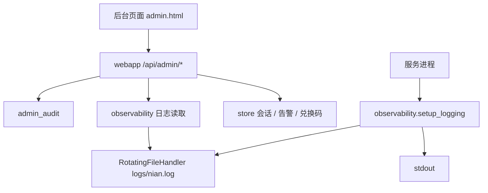

# 后台/运维增强 — 技术设计

Feature Name: admin-ops-enhancements
Updated: 2026-09-18

## Description

在既有后台基础上新增四类能力，全部复用独立管理员会话、`admin_force_totp` 守卫与 `admin_audit` 审计：

1. 用户会话管理：查看指定用户的有效会话，支持单条下线、全部下线，并可重置该用户双因素。
2. 应用日志在线查看：服务把结构化日志同时落到本地滚动文件，后台只读查看尾部并支持级别/关键词筛选。
3. 告警中心增强：告警带关联对象，支持按类型与已读状态筛选、逐条已读。
4. 导出与批量操作：兑换码全量导出、订单/审计全量导出，兑换码多选与按筛选全选批量作废。

## Architecture



- 会话下线直接删除 `sessions` 记录，复用现有校验路径，无需额外状态机。
- 日志文件由 `setup_logging` 新增的 `RotatingFileHandler` 写入，读取走独立函数，避免后台进程触碰系统日志。
- 告警与兑换码沿用既有表，只补少量列与查询。

## Components and Interfaces

### 会话管理 `ex_persona/store.py` + `ex_persona/accounts.py`

- `sessions` 表补列 `ip TEXT NOT NULL DEFAULT ''`、`user_agent TEXT NOT NULL DEFAULT ''`。
- `store.create_session(user_id, token, days, pending_totp, ip="", user_agent="")` 写两端信息；`accounts.start_session` 透传。
- `webapp._login_response` / `_admin_login_response` 不涉及；`_login_response` 从 `request` 取 `_client_ip(request)` 与 `User-Agent` 传入 `start_session`。
- `store.list_user_sessions(user_id, limit=100) -> list[dict]`：仅返回 `expires_at > now` 的会话，字段 `token_prefix`（token 前 8 位）、`ip`、`user_agent`、`created_at`、`expires_at`、`pending_totp`。
- `store.revoke_user_session(user_id, prefix) -> bool`：删除 `user_id` 匹配且 `token LIKE prefix%` 的会话，返回是否命中。
- 全部下线复用 `store.delete_user_sessions(user_id)`；重置双因素复用 `store.set_user_totp(user_id, "", False)`。

### 应用日志 `ex_persona/observability.py` + `ex_persona/webapp.py`

- `setup_logging` 在现有 `StreamHandler` 之外，新增 `RotatingFileHandler`：
  - 路径 `PERSONA_DATA_DIR/logs/nian.log`（目录不存在则创建），`maxBytes=5MB`、`backupCount=3`、编码 UTF-8、同一个 `JsonFormatter`。
  - 幂等：文件 handler 只挂一次，避免重复行。
- `log_file_path() -> Path` 与 `read_log_tail(level="", keyword="", limit=200) -> list[dict]`：
  - 从最新日志文件读取行，按 JSON 解析为 `ts/level/logger/msg`，解析失败时保留原始文本。
  - `level` 为最低严重级别（`DEBUG < INFO < WARNING < ERROR < CRITICAL`）；`keyword` 在整行小写匹配。
  - 返回按时间倒序、截断到 `limit` 的列表。
- 接口 `GET /api/admin/system/logs?level=&keyword=&limit=`（`limit` 上限 1000），只读。

### 告警中心 `ex_persona/store.py` + `ex_persona/webapp.py`

- `admin_alerts` 补列 `target TEXT NOT NULL DEFAULT ''`。
- `store.add_admin_alert(admin_id, kind, message, target="")`。
- `webapp._notify_admins(kind, message, *, target="", cooldown=...)` 透传 `target`；调用点补充对象标识：
  - `send_failed`/`crisis`/`persona`/`llm` → `user:{user_id}`；`report` → `report:{id}`；其余留空。
- `store.list_admin_alerts(admin_id, limit=60, unread_only=False, kind="", status="")` 增加类型与已读筛选。
- `store.mark_admin_alert_read(admin_id, alert_id) -> bool`。
- `GET /api/admin/alerts` 支持 `kind`、`status`、`limit`；新增 `POST /api/admin/alerts/{alert_id}/read`。

### 导出与批量作废 `ex_persona/store.py` + `ex_persona/webapp.py`

- `store.export_redemption_codes(status="") -> list[dict]`：全量返回（LEFT JOIN 兑换用户），字段含兑换码、面额、状态、批次、备注、兑换用户、创建时间、兑换时间。
- `GET /api/admin/redemption-codes/export?status=`：输出 CSV，表头「兑换码,念念币,状态,批次,备注,兑换用户,创建时间,兑换时间」。
- 订单/审计导出保持现有实现，确认导出条数上限覆盖全量（订单 5000、审计 10000）；用户导出沿用分页取全量。
- `store.batch_void_redemption_codes(ids=None, status="", all_matching=False) -> dict`：
  - `all_matching=True` 时按 `status` 筛选全部 `unused` 码；否则按 `ids`。
  - 仅作废 `status='unused'`，其余计入 `skipped`；返回 `{"voided": n, "skipped": m}`。
- `POST /api/admin/redemption-codes/batch-void`：入参 `{ids: [int], status: str, all_matching: bool}`；空选择返回 400；成功后写 `redemption.batch_void` 审计。

### 前端 `web/admin.html`

- 用户详情弹窗内新增「登录会话」区块：会话列表（IP/UA/创建时间/到期时间/待验证）、单条「下线」、底部「全部下线」与「重置双因素」，均带二次确认。
- 系统分区新增「应用日志」卡片：级别下拉、关键词输入、刷新按钮、日志列表。
- 告警卡片升级：类型与已读筛选、逐条「标记已读」、有关联对象时提供跳转（`user:{id}` → 用户详情，`report:{id}` → 举报分区）。
- 积分分区兑换码列表加复选框、表头全选、当前筛选全选、「导出 CSV」与「批量作废」按钮。

## Data Models

```sql
ALTER TABLE sessions ADD COLUMN ip TEXT NOT NULL DEFAULT '';
ALTER TABLE sessions ADD COLUMN user_agent TEXT NOT NULL DEFAULT '';
ALTER TABLE admin_alerts ADD COLUMN target TEXT NOT NULL DEFAULT '';
```

- 新增列加入 `_MIGRATIONS`，由 `init_db` 幂等补齐。
- 日志文件位于 `PERSONA_DATA_DIR/logs/nian.log`，滚动 3 份，每份 5MB。

## Correctness Properties

- I1: 会话列表只包含未过期会话，且每条仅暴露 token 前缀。
- I2: 单条下线仅删除目标用户的目标会话；全部下线删除该用户全部会话，二者均不影响其他用户。
- I3: 重置双因素后该用户 `totp_secret` 为空、`totp_enabled=0`，下次登录不再要求动态验证码。
- I4: 日志读取只读；级别筛选为「该级别及更严重」，关键词匹配整行且大小写不敏感。
- I5: 日志文件缺失或为空时返回空列表，不抛 500。
- I6: 告警筛选与逐条已读只作用于当前 `admin_id`。
- I7: 批量作废只把 `unused` 置为 `void`，`used`/`void` 计入跳过且不被修改。
- I8: 四类新增写操作均写入 `admin_audit`。
- I9: 新增后台接口在未登录时返回 401；`admin_force_totp` 开启且未绑定时返回 403。
- I10: 导出 CSV 统一 UTF-8 BOM，空结果仍输出表头。

## Error Handling

- 会话前缀未命中：`404`，`detail="会话不存在或已失效"`。
- 重置未开启双因素的用户：`400`，`detail="该用户未开启双因素"`。
- 批量作废空选择：`400`，`detail="请至少选择一个兑换码"`。
- 兑换码状态参数非法：`400`。
- 日志级别参数非法：按 `DEBUG` 处理，不报错。
- 日志文件不可读：返回空列表并记录一条服务日志。

## Test Strategy

- `tests/test_admin_ops_enhancements.py`（新增）：
  - 注册登录后列出会话、单条下线、全部下线、重置双因素及审计落库。
  - 日志 `read_log_tail` 的级别/关键词/缺失文件场景，及接口 200。
  - 告警筛选、逐条已读、target 透传。
  - 兑换码导出 CSV（含 BOM）、批量作废（unused 命中 / used 跳过）、空选择 400。
  - 未登录 401 与 `admin_force_totp` 开启未绑定 403。
- `scripts/e2e/run_chain.py`：新增会话列表与下线、日志读取、告警逐条已读、兑换码导出与批量作废链路。
- Playwright：用户详情会话区块、系统日志卡片、兑换码批量选择渲染冒烟。

## References

[^1]: (File) - 会话/告警/兑换码存储 `ex_persona/store.py`
[^2]: (File) - 后台接口与守卫 `ex_persona/webapp.py`
[^3]: (File) - 结构化日志与指标 `ex_persona/observability.py`
[^4]: (File) - 后台页面 `web/admin.html`
[^5]: (Spec) - 后台扩展 `.monkeycode/specs/2026-09-18-admin-console/requirements.md`
[^6]: (Spec) - 账号安全强化 `.monkeycode/specs/2026-09-18-account-security-hardening/requirements.md`
