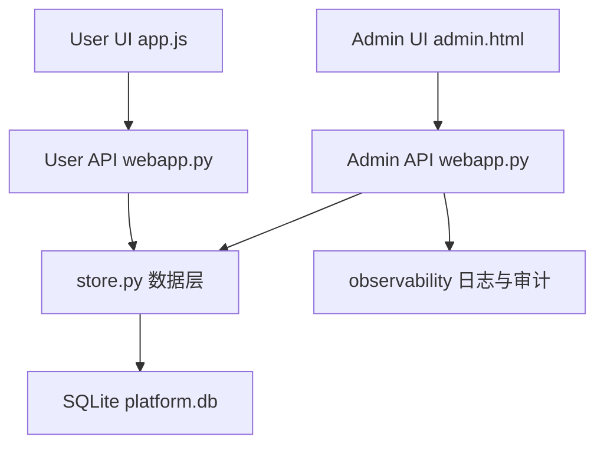
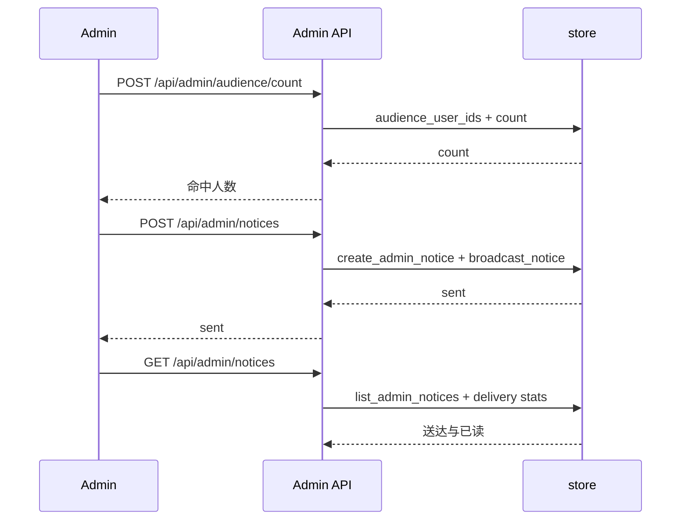

# 运营投放增强

Feature Name: ops-campaign
Updated: 2026-09-18

## Description

在现有后台「运营投放」面板上补齐受众定向、公告结构化编辑与时间窗、通知模板与变量、公告与通知的触达统计。所有能力封装在既有管理员会话与审计体系内，复用 `announcements`、`alerts`、`admin_audit` 等表，并通过幂等迁移补齐字段与新增表。

## Architecture

## Components and Interfaces

### store.py

- `segment_user_ids(audience: str, value: str = "") -> list[int]`：按 Audience_Segment 解析账号集合。所有分段排除 `status='disabled'` 的账号；`all` 为全体可用账号，`active` 取 `last_login_at` 在最近 30 天内，`paid` 取 `orders` 中存在订单，`new` 取 `created_at` 在最近 7 天内，`tag` 取 `tags` 包含值，`manual` 解析逗号分隔标识并校验存在性。
- `count_segment(audience: str, value: str = "") -> int`：返回命中数量。
- `touch_user_login(user_id: int) -> None`：登录成功后写入 `last_login_at`。
- `create_announcement(..., kind, priority, pinned, summary, link_url, link_text, status, audience, audience_value)`：创建公告并快照 `audience_count`。
- `update_announcement(announcement_id, **fields) -> bool`：局部更新公告，保留 `created_at`。
- `admin_list_announcements(limit=100) -> list[dict]`：返回公告及派生状态、覆盖与已读计数。
- `reach_stats(announcement_id) -> dict`：返回 `audience_count`、`read`、`unread`。
- `reach_users(announcement_id, state="read", limit=50, offset=0) -> dict`：分页返回已读或未读账号名单。
- `record_announcement_reads(user_id, announcement_ids) -> None`：批量写入 Read_Receipt，已存在时保留首次已读时间。
- `list_notice_templates() / create_notice_template(name, body) / update_notice_template(id, name, body) / delete_notice_template(id)`：模板管理。
- `create_admin_notice(admin_id, admin_name, message, audience, audience_value, sent) -> int`：写入发送历史。
- `broadcast_notice(user_ids, message, kind="notice", notice_id=0, render=None) -> int`：按收件人渲染 Variable 后写入 `alerts`，并回填 `notice_id`。
- `list_admin_notices(limit=50) -> list[dict]`：发送历史，附带送达与已读计数。
- `notice_stats(notice_id) -> dict`：单条通知的送达、已读与未读计数。
- `active_announcements(now="", user_id=None)`：扩展为按 `status='published'`、`active=1`、时间窗与 Audience_Segment 过滤，置顶优先。

### webapp.py 管理员接口

- `POST /api/admin/audience/count`：请求体 `{audience, audience_value}`，返回 `{count}`。
- `GET /api/admin/announcements`：返回公告列表，含 `status_label`、`audience_count`、`read_count`。
- `POST /api/admin/announcements`：扩展 `AnnouncementRequest`，新增 `summary`、`kind`、`priority`、`pinned`、`link_url`、`link_text`、`status`、`audience_value`。
- `PATCH /api/admin/announcements/{announcement_id}`：局部更新公告。
- `GET /api/admin/announcements/{announcement_id}/reach`：返回覆盖、已读、未读。
- `GET /api/admin/announcements/{announcement_id}/reach/users`：查询参数 `state`、`limit`、`offset`，返回名单与总数。
- `GET|POST /api/admin/notice-templates`、`PATCH|DELETE /api/admin/notice-templates/{template_id}`：模板 CRUD。
- `GET /api/admin/notices`：发送历史与统计。
- `GET /api/admin/notices/{notice_id}`：单条通知统计。
- `POST /api/admin/notices`：扩展 `NoticeRequest`，新增 `audience`、`audience_value`、`template_id`。

### webapp.py 用户接口

- `GET /api/announcements`：注入当前账号过滤，并在返回前写入 Read_Receipt。

### web/admin.html

- 运营投放面板拆为「公告编辑」「通知编辑」「公告列表」「发送历史」「模板管理」五块。
- 公告编辑：类型与优先级下拉、置顶开关、摘要、跳转链接与文案、`datetime-local` 起止时间、草稿与发布按钮、字符计数、实时预览卡片。
- 通知编辑：受众下拉、标签值与指定用户输入、命中人数预览、模板选择、变量插入、二次确认。
- 公告列表：状态标签、覆盖与已读计数、触达明细入口、编辑与停发。
- 发送历史：受众、命中、送达、已读、发送人、时间。
- 模板管理：列表、新建、编辑、删除。

## Data Models

### users 迁移列

- `last_login_at TEXT NOT NULL DEFAULT ''`：最近一次成功登录时间（与用户详情中按最近对话计算的 `last_active_at` 区分）。

### announcements 迁移列

- `summary TEXT NOT NULL DEFAULT ''`
- `kind TEXT NOT NULL DEFAULT 'info'`：`info`、`update`、`activity`。
- `priority TEXT NOT NULL DEFAULT 'normal'`：`normal`、`high`。
- `pinned INTEGER NOT NULL DEFAULT 0`
- `link_url TEXT NOT NULL DEFAULT ''`
- `link_text TEXT NOT NULL DEFAULT ''`
- `status TEXT NOT NULL DEFAULT 'published'`：`draft`、`published`。
- `audience_value TEXT NOT NULL DEFAULT ''`
- `audience_count INTEGER NOT NULL DEFAULT 0`

### announcement_reads 新表

- `announcement_id INTEGER NOT NULL`
- `user_id INTEGER NOT NULL`
- `read_at TEXT NOT NULL`
- 主键 `(announcement_id, user_id)`，索引 `idx_announcement_reads_ann(user_id, announcement_id)`。

### notice_templates 新表

- `id INTEGER PRIMARY KEY AUTOINCREMENT`
- `name TEXT NOT NULL`
- `body TEXT NOT NULL`
- `created_at TEXT NOT NULL`
- `updated_at TEXT NOT NULL`

### admin_notices 新表

- `id INTEGER PRIMARY KEY AUTOINCREMENT`
- `admin_id INTEGER NOT NULL`
- `admin_name TEXT NOT NULL DEFAULT ''`
- `message TEXT NOT NULL`
- `audience TEXT NOT NULL DEFAULT 'all'`
- `audience_value TEXT NOT NULL DEFAULT ''`
- `sent INTEGER NOT NULL DEFAULT 0`
- `created_at TEXT NOT NULL`

### alerts 迁移列

- `notice_id INTEGER NOT NULL DEFAULT 0`

### Audience_Segment 编码

`audience` 存分段标识，`audience_value` 存附加参数（`tag` 存标签文本，`manual` 存逗号分隔账号标识）。旧数据的 `audience='all'` 与默认字段保持可用。

### Variable 语法

正文中使用 `{username}`、`{nickname}`、`{coins}`、`{credits}`、`{tickets}`。渲染在服务端按收件人执行，未识别的占位符原样保留。

## Correctness Properties

- **I1**：`users.last_login_at` 只在成功登录后更新。
- **I2**：所有 Audience_Segment 均排除 `status='disabled'` 的账号；`manual` 忽略不存在的标识。
- **I3**：`status='draft'` 的公告对用户端不可见且触达统计为空。
- **I4**：`announcement_reads` 每个 `(announcement_id, user_id)` 至多一条，重复拉取保留首次 `read_at`。
- **I5**：通知送达人数等于该 `notice_id` 的 `alerts` 行数，已读人数等于其中 `read_at != ''` 的行数。
- **I6**：公告覆盖人数在发布时快照；触达统计以快照与已读记录计算，未读不为负。
- **I7**：`admin_notices.message` 保存未渲染的原始正文，Variable 渲染不写回历史。
- **I8**：所有管理员写接口都要求 `current_admin` 并写入 Audit；非管理员访问返回 401。
- **I9**：既有公告升级后可读、可停发，用户接口返回结构保持向后兼容。

## Error Handling

- 标题为空、结束时间早于开始时间、模板名称为空：返回 400 与字段提示。
- 目标受众为空：返回 400 与「目标受众为空」。
- 公告或模板不存在：返回 404。
- `DELETE /api/admin/notice-templates/{id}` 删除不存在的模板：返回 404。
- 触达明细的 `state` 非 `read` 或 `unread`：按 `read` 处理。
- 日志与审计写入失败：沿用既有 `_audit` 的容错语义，不阻断主流程。

## Test Strategy

- 新增 `tests/test_ops_campaign.py`：分段解析（活跃、付费、新用户、标签、指定与空集）、`last_login_at` 写入、公告创建与 PATCH、草稿不可见、时间窗过滤与置顶排序、Read_Receipt 幂等、触达统计与名单分页、模板 CRUD、通知受众与变量渲染、通知历史统计、401 守卫。
- 迁移测试：在既有库结构上执行 `init_db` 后校验新增列与新表存在且幂等。
- `scripts/e2e/run_chain.py` 增加链路：管理员圈定受众、发布带时间窗公告、用户拉取并产生已读、通知发送后统计送达与已读。
- 回归：`python3 -m unittest discover -s tests`、`python3 -m ruff check ex_persona tests scripts`、`python3 scripts/e2e/run_chain.py`。
- 前端：Playwright 探针校验运营投放面板渲染与移动端无横向溢出。

## References

[^1]: (store.py) - [数据层函数与迁移](ex_persona/store.py)
[^2]: (webapp.py) - [管理员与用户接口](ex_persona/webapp.py)
[^3]: (admin.html) - [后台运营投放面板](web/admin.html)
