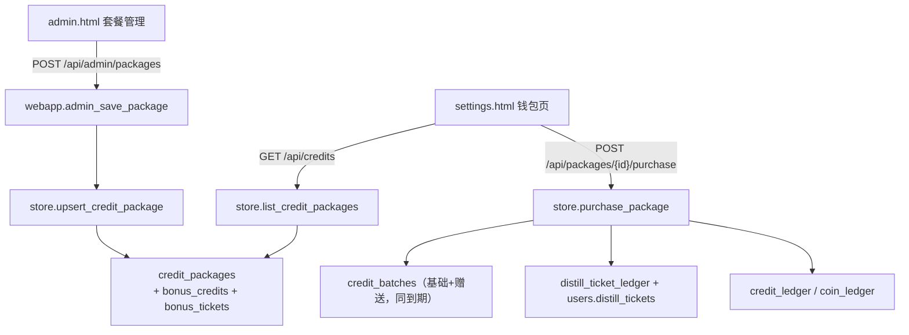

# 套餐档位分组与购买赠送 — 技术设计

Feature Name: package-tiers-bonus
Updated: 2026-09-18

## Description

在既有的按批次到期积分体系上，引入「档位分组 + 购买赠送」：

- 档位分组是展示层的分组，数据层仍由 `credit_packages.validity_days` 决定档位。
- 套餐新增 `bonus_credits` 与 `bonus_tickets` 两个整型字段，购买时分别发放。

## Architecture



## Components and Interfaces

### 数据层 `ex_persona/store.py`

- `DEFAULT_PACKAGES` 不变（赠送默认 0）。
- `_MIGRATIONS["credit_packages"]` 新增：
  - `bonus_credits INTEGER NOT NULL DEFAULT 0`
  - `bonus_tickets INTEGER NOT NULL DEFAULT 0`
- `upsert_credit_package(...)` 新增 `bonus_credits: int = 0`、`bonus_tickets: int = 0`，
  写入 INSERT / UPDATE；两者取 `max(x, 0)`。
- `purchase_package(user_id, package_id, idem)`：
  - `total_gain = credits + bonus_credits`；`total_gain` 写入单条积分批次，原因
    「套餐到账：{name}」，赠送为正时原因追加「（含赠送 {bonus}）」。
  - `bonus_tickets > 0` 时在同一事务内 `UPDATE users.distill_tickets += bonus_tickets`
    并写入 `distill_ticket_ledger`（reason「套餐赠送：{name}」，ref `package:{id}`）。
  - 返回值新增 `bonus_credits`、`bonus_tickets`。

### 接口层 `ex_persona/webapp.py`

- `PackageRequest` 新增 `bonus_credits: int = 0`、`bonus_tickets: int = 0`。
- `admin_save_package`：校验 `bonus_credits >= 0`、`bonus_tickets >= 0`，负数返回 400，
  并透传给 `upsert_credit_package`。
- `GET /api/credits` 返回的 `packages[*]` 自动带出新字段（`SELECT *`）。

### 前端

- `web/settings.html`：
  - 以 `VALIDITY_ORDER = [30, 90, 365]` 把 `packages` 分成三组，依次渲染
    「月度 / 季度 / 年度」分区标题（`.pack-tier`），空组不渲染。
  - 卡片积分行在基础积分后追加赠送积分胶囊 `+{bonus_credits}`；副标或独立徽标展示
    「赠 {bonus_tickets} 张蒸馏券」。
- `web/admin.html`：
  - `renderPackages` 按 `validity_days` 分组渲染，每组一个 `.pkg-tier` 标题。
  - 套餐表单新增「赠送积分」「赠送蒸馏券」两个 number 输入，新增套餐表单同样新增。
  - 保存时读取并提交 `bonus_credits` / `bonus_tickets`。

## Data Models

```sql
ALTER TABLE credit_packages ADD COLUMN bonus_credits INTEGER NOT NULL DEFAULT 0;
ALTER TABLE credit_packages ADD COLUMN bonus_tickets INTEGER NOT NULL DEFAULT 0;
```

## Correctness Properties

- I1: 购买套餐产生的积分批次总量 = `credits + bonus_credits`，到期时间一致。
- I2: 购买套餐后 `users.credits` 增量 = `credits + bonus_credits`；
  `users.distill_tickets` 增量 = `bonus_tickets`。
- I3: 幂等键 `package.purchase:{package_id}:{idem}` 命中时不再发放。
- I4: 赠送蒸馏券不写 `expires_at`，不影响券的永久有效性。
- I5: 档位分组只影响展示，不改变任何扣减与到期语义。

## Error Handling

- `bonus_credits < 0` 或 `bonus_tickets < 0`：`400`，`detail="赠送数量不能为负"`。
- 其余错误沿用套餐保存与购买的既有映射。

## Test Strategy

- `tests/test_credit_expiry.py`：套餐赠送字段持久化与 `validity_label`。
- `tests/test_package_bonus.py`（新增）：
  - 购买套餐到账 = 基础 + 赠送，且批次到期一致。
  - 赠送蒸馏券到账并写流水，且不过期。
  - 幂等重试不重复发放。
  - 后台保存负数赠送返回 400。
- `scripts/e2e/run_chain.py`：新增「购买带赠送套餐」链路断言。
- jsdom 探针：`render_settings.js` 校验三个档位分区与赠送标记；
  `render_admin.js` 校验分组标题与赠送输入。
