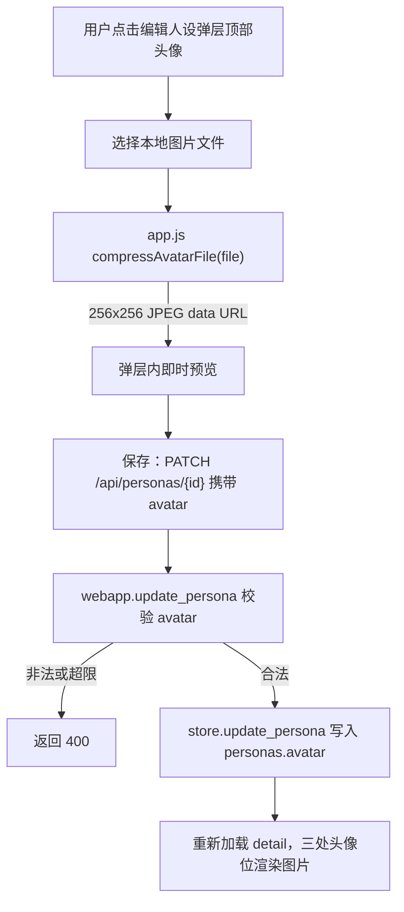

# Persona Avatar Upload

Feature Name: persona-avatar-upload
Updated: 2026-09-19

## Description

为分身（persona）增加自定义头像上传能力。用户在「手动编辑人设」弹层顶部点击头像并选择本地图片，前端将图片居中裁剪并压缩为 256×256 JPEG，随 `PATCH /api/personas/{persona_id}` 提交；服务端校验后写入 `personas.avatar`。工作台、分身列表、朋友圈三处头像位在存在头像数据时展示图片，否则回退为渐变首字头像。

## Architecture

现有用户资料头像已经验证了「前端压缩 + `data:image/` + 长度上限」方案，本功能复用同一约定，避免引入对象存储与新的上传接口。

## Components and Interfaces

### Backend

- `ex_persona/webapp.py` `update_persona`（`PATCH /api/personas/{persona_id}`）
  - 在写入 `fields["avatar"]` 前，按用户资料头像的规则校验：
    - 非空头像必须以 `data:image/` 开头，否则 `HTTPException(400, "头像格式不受支持")`。
    - 头像长度不得超过 `400_000` 字符，否则 `HTTPException(400, "头像过大，请换一张")`。
    - 空字符串表示清除头像，允许写入 `""`。
  - 抽出 `_validate_avatar(value: str) -> str` 复用，供 `update_persona` 与后续可能的调用方使用。
- `ex_persona/store.py`：无需改动，`personas.avatar` 列与 `update_persona(..., avatar=...)` 已存在。

### Frontend shared helpers

- `web/static/app.js` 新增：
  - `compressAvatarFile(file)`：返回 `Promise<string>`，将图片居中裁剪为 256×256，`canvas.toDataURL("image/jpeg", 0.86)`。
  - `avatarImgMarkup(avatar)`：非空时返回 ``（对双引号做转义），否则返回 `""`。
- `web/settings.html`：把本地 `readAvatar` 改为调用 `compressAvatarFile`，消除重复的压缩逻辑（行为保持不变）。
- `web/agent.html` `openEdit()`：在弹层顶部增加头像区（按钮 + 隐藏 file input + 「点击更换头像」提示），保存时若选择了新头像则把 `avatar` 一并放入 PATCH payload；同时支持清除头像（可选：提供「恢复默认」按钮把 `avatar` 置空）。
- `web/agent.html` 工作台头部、`web/app.html` 分身卡片、`web/moments.html` 动态头部：头像位改为「有头像渲染图片，无头像渲染渐变首字」。
- `web/moments.html` 增加 `.moments-avatar img` 样式，使图片填满并继承圆角。

### Interfaces

| 方法 | 路径 | 请求 | 响应 |
| --- | --- | --- | --- |
| PATCH | `/api/personas/{persona_id}` | `{ "avatar": "data:image/jpeg;base64,..." }` | `_persona_detail`（含 `persona.avatar`） |
| PATCH | `/api/personas/{persona_id}` | `{ "avatar": "" }` | 清除头像后的 `_persona_detail` |

## Data Models

`personas.avatar TEXT NOT NULL DEFAULT ''`（已存在，无需迁移）。

- 空串：无自定义头像，展示渐变首字头像。
- `data:image/...;base64,...`：自定义头像数据，长度 ≤ 400,000 字符。

## Correctness Properties

1. 分身头像与用户资料头像相互独立：修改 `personas.avatar` 不改变用户 `users.avatar`，反之亦然。
2. 幂等性：重复提交同一头像数据结果一致，不产生额外副作用。
3. 权限封闭：`update_persona` 通过 `_require_persona(user_id, persona_id)` 保证只能操作本账号的分身；非本人分身返回 404，未登录返回 401。
4. 回退完备：任一头像位在 `avatar` 为空时都能展示渐变首字头像，不出现空白或破图。

## Error Handling

| 场景 | 处理 |
| --- | --- |
| 本地文件读取/解码失败 | 前端提示「图片读取失败，请换一张」，不提交请求 |
| `avatar` 非 `data:image/` 前缀 | 服务端 400「头像格式不受支持」 |
| `avatar` 超过 400,000 字符 | 服务端 400「头像过大，请换一张」 |
| 非本人分身 | 服务端 404（`_require_persona`） |
| 未登录 | 服务端 401（`current_user` 依赖） |
| 数据库写入失败 | 由现有 `store.update_persona` 事务回滚，接口返回 500 |

## Test Strategy

- 后端单元测试（新增 `tests/test_persona_avatar.py`）：
  - 合法 `data:image/png;base64,...` 更新成功，`persona.avatar` 与详情一致。
  - 非 `data:image/` 前缀返回 400。
  - 超过 400,000 字符返回 400。
  - 空字符串清除头像。
  - 非本人分身返回 404，未登录返回 401。
- 前端契约测试：断言 `web/agent.html` 含「点击更换头像」与头像上传控件；三处头像位页面包含 `avatarImgMarkup` 调用。
- 手工验证：用 Playwright 打开工作台编辑人设，上传一张图，确认工作台、分身列表、朋友圈三处均展示新头像；再清除头像确认回退为渐变首字。
- 回归：`python3 -m unittest discover -s tests`、`python3 -m ruff check ex_persona tests`、`python3 scripts/e2e/run_chain.py` 全绿。

## References

[^1]: (webapp.py#L2163) - [update_persona 处理逻辑](../../../ex_persona/webapp.py)
[^2]: (store.py#L468) - [personas.avatar 列定义](../../../ex_persona/store.py)
[^3]: (settings.html#L305) - [用户头像压缩实现 readAvatar](../../../web/settings.html)
[^4]: (agent.html#L366) - [手动编辑人设弹层 openEdit](../../../web/agent.html)
[^5]: (app.html#L61) - [分身列表头像位](../../../web/app.html)
[^6]: (moments.html#L147) - [朋友圈头像位](../../../web/moments.html)
[^7]: (app.css#L359) - [.avatar img 样式](../../../web/static/app.css)
