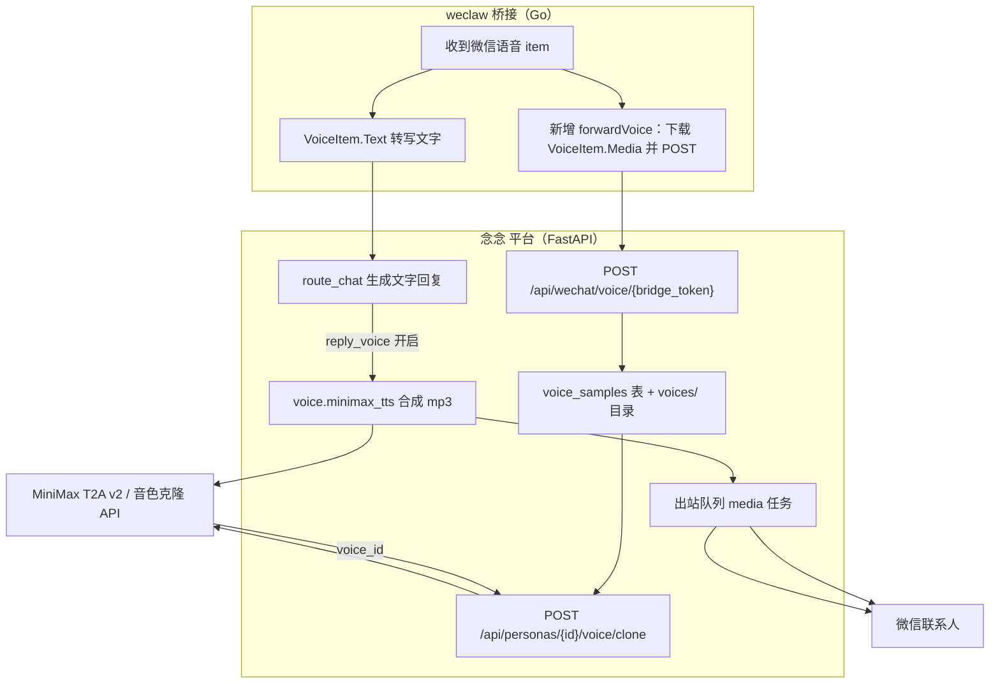

# WeChat Voice Inbound/Outbound with Voice Cloning

Feature Name: wechat-voice
Updated: 2026-09-19

## Description

打通微信语音双向能力。入站：weclaw 在把微信语音转写文字交给平台的同时，额外把原始音频转发到平台，按「分身 + 联系人」归档为语音样本。出站：分身开启 `advanced.reply_voice` 后，文字回复照常发送，并额外用 MiniMax TTS 合成一段音频、经现有出站队列以媒体文件发送到微信（weclaw 当前把音频归类为文件，故为「语音文件降级」方案）。音色克隆使用 MiniMax 复刻接口，样本来自对方发来的微信语音；未克隆时使用 MiniMax 系统预设音色。

## Architecture



文字回复路径保持不变：`route_chat` 仍同步返回文字给 weclaw。语音回复在后台线程合成后再入队，不阻塞文字返回。入站语音转发为尽力而为，失败只记录日志，不影响转写文字继续对话。

## Components and Interfaces

### weclaw 补丁（Go）

- `config/config.go`：新增 `VoiceEndpoint string json:"voice_endpoint,omitempty"` 与 `WECLAW_VOICE_ENDPOINT` 环境变量，沿用 `MediaEndpoint` 的模式。
- `cmd/start.go`：当 `cfg.VoiceEndpoint != ""` 时调用 `handler.SetVoiceEndpoint(cfg.VoiceEndpoint)`。
- `messaging/handler.go`：
  - 新增 `extractVoice(msg) *ilink.VoiceItem` 与 `downloadVoice(ctx, v) ([]byte, error)`（复用 `downloadFile` / `DownloadFileFromCDN`）。
  - 新增 `forwardVoice(ctx, msg, v) bool`：multipart POST 到 `voiceEndpoint`，附带 `X-WeChat-From`、`X-WeChat-Message-ID`、`X-Voice-Duration-Ms`、`X-Voice-Transcript`。
  - 在 `HandleMessage` 中，转写文字提取之后、图片分支之前，若 `voiceEndpoint` 已配置且 `v.Media != nil`，调用 `forwardVoice`；返回值不影响 `text` 是否继续走 agent。
- 构建与验证：沿用 `scripts/weclaw/build.sh` 与 `scripts/weclaw/zz_patch_test.go`，补丁追加到 `scripts/weclaw/nian.patch`。

### 平台入站

- `ex_persona/webapp.py` 新增 `POST /api/wechat/voice/{bridge_token}`：
  - 复用 `_rate_limited(bridge_token)`、`crypto.verify_bridge_token`、`store.get_binding_by_token`。
  - 读取 multipart `file`，校验字节数 ≤ 5,000,000，按音频容器嗅探扩展名。
  - `contact` 取 `X-WeChat-From`；样本落盘到 `Path(persona["dir"]) / "voices" / _safe_contact(contact) / f"msg-{message_id}{ext}"`。
  - 以 `source_message_id` 幂等：已存在则直接返回成功。
  - 写入 `voice_samples` 并调用 `store.prune_voice_samples` 保留最新 20 条。
- 新增 `ex_persona/voice.py`：音频校验与元数据工具（`sniff_audio_ext`、`probe_duration_ms` 可选）。

### 平台音色与出站

- `ex_persona/voice.py`：
  - `PRESET_VOICES`：`female-1`/`female-2`/`male-1`/`male-2` 映射 MiniMax 系统音色 id（如 `female-shaonv`、`female-yujie`、`male-qn-qingse`、`male-qn-jingying`）。
  - `minimax_tts(text, voice_id, *, api_key, base_url, model, timeout) -> bytes`：调用 `POST {base_url}/t2a_v2`，`audio_setting.format="mp3"`，返回十六进制音频解码后的字节。
  - `minimax_clone(sample_paths, *, api_key, base_url, model, voice_id) -> dict`：先上传样本文件，再调用音色克隆接口，返回 `voice_id`。
  - `VoiceError`（含 `auth` 标记）区分鉴权错误与临时错误。
- `ex_persona/webapp.py`：
  - `GET /api/personas/{persona_id}/voice`：返回当前音色、克隆状态、样本总时长与条数、预设列表、平台是否已配置。
  - `POST /api/personas/{persona_id}/voice/clone`：body `{contact, consent}`；校验 `consent` 为真、样本总时长 ≥ 10 秒、无进行中克隆；先扣 `voice_clone_cost`，调用 `minimax_clone`，成功写 `voice_clones` 并更新 `personas.settings.voice`，失败退回积分并置 `failed`。
  - `POST /api/personas/{persona_id}/voice/preview`：body `{voice_id}`；合成固定示例文本，返回 `audio/mpeg`。
  - `PATCH /api/personas/{persona_id}`：沿用现有设置合并，`advanced.reply_voice` 与 `voice.preset` 已可持久化，新增 `voice.clone_contact` 写入校验。
  - 出站：在 `route_chat` 拿到最终 `reply` 后，若 `settings["advanced"].get("reply_voice")` 为真且 `reply` 非空且平台密钥就绪，调用 `_start_voice_reply(user_id, persona, contact, reply)`：后台线程 TTS 合成 mp3 → 扣 `voice_reply_cost` → `_outbox.enqueue(user_id, contact, media=path)`；失败只记录不扣费。文字返回路径不变。

### 管理后台

- `web/admin.html` 新增「语音设置」卡片：MiniMax Key（密码框，保存走加密）、TTS 模型名、音色克隆成本、语音回复成本、启用开关。
- 新增 `ex_persona/webapp.py` 管理接口：`GET/PUT /api/admin/platform/voice` 或在现有平台配置接口中扩展字段。
- 后台用量区展示音色克隆次数与语音回复条数。

### 用户端

- `web/agent.html` `openTuning()` 内语音区：语音回复开关、预设音色下拉、当前克隆状态、样本总时长、`克隆音色` 按钮、`试听` 按钮、同意声明勾选框。
- `web/static/app.js`：新增 `playVoicePreview(url)` 与音频上传/播放辅助；语音预览返回的 blob URL 用于 `<audio>` 播放。

### Interfaces

| 方法 | 路径 | 请求 | 响应 |
| --- | --- | --- | --- |
| POST | `/api/wechat/voice/{bridge_token}` | multipart `file` + `X-WeChat-From`/`X-WeChat-Message-ID`/`X-Voice-Duration-Ms` | `{ok, sample_id}` |
| GET | `/api/personas/{id}/voice` | - | `{preset, clone_status, sample_seconds, sample_count, presets[], ready}` |
| POST | `/api/personas/{id}/voice/clone` | `{contact, consent}` | `{clone_status, voice_id}` |
| POST | `/api/personas/{id}/voice/preview` | `{voice_id}` | `audio/mpeg` |
| PUT | `/api/admin/platform/voice` | `{key, model, clone_cost, reply_cost, enabled}` | 平台配置 |
| PATCH | `/api/personas/{id}` | `{advanced:{reply_voice}, voice:{preset}}` | `_persona_detail` |

## Data Models

```sql
CREATE TABLE IF NOT EXISTS voice_samples (
    id INTEGER PRIMARY KEY AUTOINCREMENT,
    user_id INTEGER NOT NULL,
    persona_id INTEGER NOT NULL,
    contact TEXT NOT NULL DEFAULT '',
    path TEXT NOT NULL,
    bytes INTEGER NOT NULL DEFAULT 0,
    duration_ms INTEGER NOT NULL DEFAULT 0,
    source_message_id TEXT NOT NULL DEFAULT '',
    created_at TEXT NOT NULL,
    UNIQUE(persona_id, source_message_id)
);

CREATE TABLE IF NOT EXISTS voice_clones (
    id INTEGER PRIMARY KEY AUTOINCREMENT,
    user_id INTEGER NOT NULL,
    persona_id INTEGER NOT NULL,
    contact TEXT NOT NULL DEFAULT '',
    provider TEXT NOT NULL DEFAULT 'minimax',
    voice_id TEXT NOT NULL DEFAULT '',
    status TEXT NOT NULL DEFAULT 'pending',
    error TEXT NOT NULL DEFAULT '',
    sample_seconds REAL NOT NULL DEFAULT 0,
    created_at TEXT NOT NULL,
    updated_at TEXT NOT NULL,
    UNIQUE(persona_id, contact)
);
```

`platform_config` 新增列（经 `_MIGRATIONS` 自动迁移）：
`minimax_api_key_encrypted TEXT NOT NULL DEFAULT ''`、`voice_tts_model TEXT NOT NULL DEFAULT 'speech-02-turbo'`、`voice_clone_cost INTEGER NOT NULL DEFAULT 500`、`voice_reply_cost INTEGER NOT NULL DEFAULT 20`、`voice_enabled INTEGER NOT NULL DEFAULT 0`。

`personas.settings.voice` 扩展为：`{asr, tts, voice, preset, clone_voice_id, clone_status, clone_contact}`；默认值在 `persona_settings.DEFAULT_SETTINGS["voice"]` 补齐，`validate()` 收敛 `preset` 与 `clone_status`。

样本文件：`{persona_dir}/voices/{safe_contact}/msg-{message_id}.{ext}`，单条 ≤ 5,000,000 字节，每个联系人保留最新 20 条。

## Correctness Properties

1. 样本上传按 `(persona_id, source_message_id)` 幂等：重复投递不产生新文件或新行。
2. 克隆按 `(persona_id, contact)` 唯一：进行中拒绝重复发起；成功后 `voice_id` 稳定。
3. 扣费对称：克隆失败必退 `voice_clone_cost`；语音回复合成失败不扣 `voice_reply_cost`。
4. 文字优先：任何 TTS、克隆或平台密钥缺失都不阻断文字回复的生成与返回。
5. 权限封闭：所有 `/api/personas/{id}/voice*` 经 `_require_persona` 校验归属；桥接端点经 `bridge_token` 校验。
6. 密钥安全：MiniMax Key 仅以 `crypto.encrypt` 密文入库，接口只返回是否已配置。
7. 样本上限稳定：任一联系人样本数不超过 20 条，按 `created_at` 保留最新。

## Error Handling

| 场景 | 处理 |
| --- | --- |
| 入站音频超限或非音频 | 平台返回 400，weclaw 仅记录日志，文字继续 |
| 入站转发超时/网络错误 | weclaw 记录日志并继续文字流程 |
| 重复语音消息 ID | 平台复用已有样本并返回成功 |
| 样本总时长不足 10 秒 | 克隆接口返回 400「语音样本不足，至少需要 10 秒」 |
| 未勾选同意声明 | 克隆接口返回 400「请先确认已获得声音权利人同意」 |
| 余额不足 | 返回 402，不调用 MiniMax |
| MiniMax 鉴权失败 | 克隆置 `failed` 并退款；语音回复记录失败不扣费 |
| MiniMax 临时错误/超时 | 同上，允许用户重试 |
| 平台未配置密钥 | 语音接口返回 400「平台未配置语音服务」；回复自动跳过语音 |
| TTS 成功但入队失败 | 记录失败并退回 `voice_reply_cost` |

## Test Strategy

- 后端单元测试：
  - `tests/test_voice_samples.py`：音频合法落盘、超限 400、消息 ID 幂等、20 条上限、权限 401/404。
  - `tests/test_voice_clone.py`：样本不足 400、未同意 400、扣费与失败退款、重复发起 409/400、成功写 `voice_id`。
  - `tests/test_voice_reply.py`：`reply_voice` 开启时入队 media 且扣 `voice_reply_cost`、TTS 失败不扣且文字仍返回、未配置密钥跳过、空回复跳过。
  - `tests/test_platform_config.py`：语音成本与密钥字段读写、密钥不回显。
- 契约测试：断言 `admin.html` 含「语音设置」与成本字段；`agent.html` 含「克隆音色」「试听」与同意勾选框；`voice.py` 含 `t2a_v2` 与复制接口调用。
- weclaw：`scripts/weclaw/zz_patch_test.go` 覆盖 `extractVoice`/`forwardVoice` 的构造；`build.sh` 编译通过。
- 手工验证：用 Playwright 打开语音设置，点击试听确认音频返回；模拟样本不足与未同意的错误提示。
- 回归：`python3 -m unittest discover -s tests`、`python3 -m ruff check ex_persona tests`、`python3 scripts/e2e/run_chain.py` 全绿。

## 增量：多提供商（MiniMax / 豆包）

平台新增 `voice_provider`（`minimax` 默认 / `doubao`），两套凭据并存、后台可切换，用户端行为不变。

- 数据层：`platform_config` 再增 `voice_provider TEXT NOT NULL DEFAULT 'minimax'`、`doubao_api_key_encrypted`、`doubao_app_id`、`doubao_access_token_encrypted`、`doubao_resource_id`；`voice_clones.provider` 记录发起时的提供商。
- 抽象：`voice.VoiceCredentials` + `voice.credentials(config)` 汇总凭据；`voice.synthesize(text, voice_id, creds, is_clone=)` 与 `voice.clone(samples, voice_id, creds)` 按 `provider` 分派到 `minimax_*` 或 `doubao_*`。`minimax_tts`/`minimax_clone` 保持不变。
- 预设音色按提供商映射：`PRESET_VOICES_BY_PROVIDER`；`system_voice_id(preset, provider)` / `active_voice_id(settings, provider)`。豆包映射到 2.0 音色（如 `zh_female_gaolengyujie_uranus_bigtts`）。
- 豆包接口（V3）：
  - 合成 `POST {base}/api/v3/tts/unidirectional`，`X-Api-Resource-Id` 按音色推断（复刻 `seed-icl-2.0` / 2.0 `seed-tts-2.0` / 1.0 `seed-tts-1.0`），响应为分块 JSON，逐块取 `data` base64 拼接为 mp3。
  - 复刻 `POST {base}/api/v3/tts/voice_clone`，`speaker_id="custom_speaker_id"` + `custom_speaker_id=<voice_id>`，音频 base64 放入 `audio.data`。
  - 鉴权：新版控制台 `X-Api-Key`；旧版控制台 `X-Api-App-Key` + `X-Api-Access-Key`，二选一。
- 就绪判定：`PlatformConfig.voice_credentials_ready` 按当前提供商判断；`voice_ready = 就绪 && voice_enabled`。豆包凭据缺失不会误判为已就绪。
- 后台：`/api/admin/platform` 增 `voice_provider`、`doubao_app_id`、`doubao_resource_id` 与豆包密钥的 `has_*`/脱敏字段；`admin.html` 增提供商下拉与豆包字段。密钥仍仅存密文、不回显。

## 增量：用户上传音频样本

除被动接收微信语音外，用户可主动上传本地音频作为克隆样本。

- 接口：`POST /api/personas/{persona_id}/voice/samples`（登录态 + `_require_persona` 鉴权），multipart 字段 `file` 与 `contact`（缺省回退到 `voice.clone_contact`）。
- 校验：空文件 400；超过 `VOICE_SAMPLE_MAX_BYTES`(5MB) 413；文件头无法识别为音频 400；用临时目录探测时长，无法解码时再尝试 `build_clone_audio` 转 wav 复探，仍失败 400；超过 `VOICE_SAMPLE_MAX_MS`(120s) 413。只有全部校验通过才落入 `{persona_dir}/voices/{contact}/upload-<hex><ext>` 并写库，避免残留孤儿文件。
- 复用：`_sniff_audio_ext`、`store.add_voice_sample`（含每联系人 20 条上限）、`store.voice_sample_summary`、`observability.METRICS.inc("voice.sample_upload")`。
- 前端：`web/agent.html` `openVoice()` 增加「上传本地音频」按钮与隐藏多选 `input[accept=audio/*]`，逐条 `FormData` 上传，成功后刷新面板；`api()` 已对 `FormData` 跳过 JSON Content-Type。
- 测试：`tests/test_voice_samples.py::VoiceUploadApiTest` 覆盖成功、缺联系人、非音频、超大、超长、不可解码；契约测试覆盖前端标记与端点存在。

## 增量：语音收集开关与进度

自动收集可能长期累积样本，用户需要可控开关与可见进度。

- 设置：`persona_settings.voice.collect`（默认 `true`，`validate()` 归一为布尔），随 `PUT /api/personas/{id}/settings` 保存。
- 入站：`POST /api/wechat/voice/{bridge_token}` 在解析人格后读取 `voice.collect`，关闭时直接返回 `{"ok":true,"skipped":true,"reason":"collect_disabled"}`，不落盘、不写库。
- 详情：`_persona_voice_detail` 返回 `collect`，前端据此渲染开关。
- 前端：`openVoice()` 新增「语音收集」分组：自动收集开关 + 收集进度条（`sample_seconds/min_seconds` 百分比）+ 结果文案（已收集条数/秒数、是否足够、还差几秒、暂停提示）；开关切换即时更新结果文案。克隆 `pending` 时每 5 秒轮询 `/voice`，状态变化后自动刷新面板，实现克隆进度与结果回显。

## References

[^1]: (handler.go#L734) - [weclaw 语音转写 extractVoiceText](../../../scripts/weclaw/nian.patch)
[^2]: (media.go#L55) - [weclaw 媒体发送 sendMediaData 仅 image/video/file](../../../scripts/weclaw/nian.patch)
[^3]: (webapp.py#L2295) - [入站图片回调 wechat_media](../../../ex_persona/webapp.py)
[^4]: (webapp.py#L1075) - [出站队列 _outbox_send](../../../ex_persona/webapp.py)
[^5]: (webapp.py#L3499) - [route_chat 回复生成与入队](../../../ex_persona/webapp.py)
[^6]: (persona_settings.py#L58) - [voice 设置默认值](../../../ex_persona/persona_settings.py)
[^7]: (config.py#L25) - [PlatformConfig 字段](../../../ex_persona/config.py)
[^8]: (store.py#L276) - [platform_config 表定义](../../../ex_persona/store.py)
[^9]: (MiniMax T2A v2) - [T2A v2 接口文档](https://platform.minimaxi.com/document/T2A%20Large%20v2)
